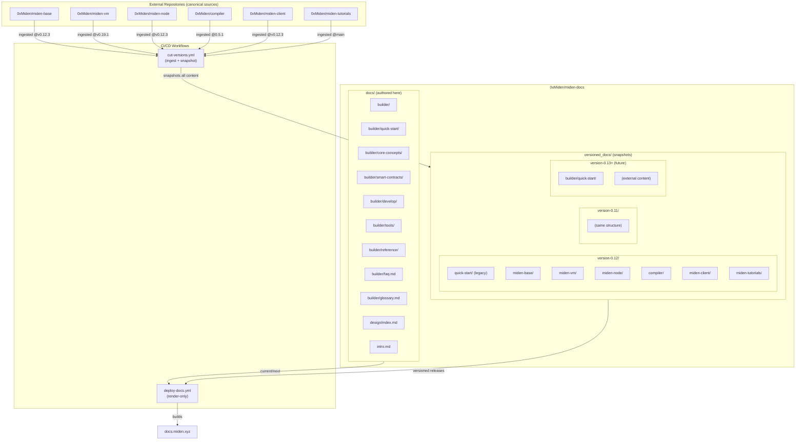

# miden-docs

Consolidated documentation for the Miden rollup

---

## Documentation Dependency & Versioning Model

This documentation site combines content **authored in this repo** with content **ingested from external Miden repositories**. Understanding this ownership model is critical for contributors.

### Dependency Diagram



### Content Ownership

| Category | Location | Source | Example |
|----------|----------|--------|---------|
| **Authored** | `docs/` | Written in this repo | `docs/builder/quick-start/`, `docs/builder/faq.md` |
| **Ingested** | `versioned_docs/` only | External repos | `versioned_docs/version-0.12/miden-base/` |
| **Snapshots** | `versioned_docs/` | Frozen via `docs:version` | All versioned content |

### What Each Location Contains

**`docs/` (current/next version)**
- Quick Start guides (`docs/builder/quick-start/`)
- Core Concepts, Smart Contracts, Reference (placeholders)
- FAQ and Glossary
- Landing pages for Builder and Design

**`versioned_docs/` (frozen releases)**
- Snapshots of `docs/` at release time
- Ingested external content (Protocol, VM, Compiler, Node, Client, Tutorials)
- Each version is immutable after creation

### Why Content Appears in Both Places

When `docusaurus docs:version X.Y` runs, it snapshots **everything in `docs/`** into `versioned_docs/version-X.Y/`. This is versioning, not duplication:

- `docs/builder/quick-start/` → edited live, appears in "current/next"
- `versioned_docs/version-0.12/quick-start/` → frozen snapshot from release 0.12

**External content is never copied into `docs/`** because:
1. It would create content drift between source repos and this site
2. The ingestion workflow would overwrite manual edits
3. Contributors wouldn't know which copy is canonical

### Legacy Note

Older versioned snapshots (0.11, 0.12) contain `quick-start/` at the root level. New versions will snapshot `builder/quick-start/` inside the builder directory.

---

## How to Cut and Deploy a New Docs Release

### When to Cut a New Version

Cut a new documentation version when:
- A new protocol release ships (miden-base, miden-vm, miden-node, compiler)
- Client or tutorial content has significant updates
- Authored content (Quick Start, FAQ, Glossary) needs to be frozen for a release

### Steps to Cut a Release

#### 1. Update the Release Manifest

Edit `.release/release-manifest.yml`:

```yaml
version: "0.13"  # New version label

refs:
  miden-base: v0.13.0      # Pin to release tag
  miden-vm: v0.20.0
  miden-node: v0.13.0
  compiler: 0.6.0
  miden-client: v0.13.0
  miden-tutorials: main    # Or specific commit/tag
```

#### 2. Run the Version Cut Workflow

Trigger `.github/workflows/cut-versions.yml` (manually or via push to manifest):

The workflow executes these steps:
1. **Checkout external repos** at pinned refs
2. **Aggregate docs temporarily** into `docs/` (miden-base/, miden-vm/, etc.)
3. **Run `docusaurus docs:version X.Y`** to snapshot everything
4. **Clean up `docs/`** — remove aggregated external content
5. **Commit `versioned_docs/version-X.Y/`** to the repository

After the workflow completes:
- `versioned_docs/version-X.Y/` contains the frozen snapshot
- `docs/` returns to authored-only content
- `versions.json` is updated with the new version

#### 3. Merge the Generated Snapshot

The workflow commits directly to the branch. Review and merge to `main`.

### Steps to Deploy

Deployment is **automatic** on push to `main`.

The `.github/workflows/deploy-docs.yml` workflow:
1. Checks out **only this repository** (no external repos)
2. Runs `npm run build` to generate the static site
3. Deploys to GitHub Pages at `docs.miden.xyz`

The build uses:
- `docs/` → serves as "current/next" (unreleased) version
- `versioned_docs/` → serves as versioned releases (0.11, 0.12, etc.)

**The deploy workflow never ingests external repositories.** All external content must be snapshotted via `cut-versions.yml` first.

---

## Contributor Guidelines

### ✅ DO

- Edit Quick Start content in `docs/builder/quick-start/`
- Edit FAQ and Glossary in `docs/builder/`
- Edit Protocol/VM/Compiler/Node docs **in their source repositories**
- Cut a new version to publish external documentation changes
- Use `cut-versions.yml` to create release snapshots

### ❌ DON'T

- **Never** copy external content into `docs/`
- **Never** create `docs/miden-base/`, `docs/miden-vm/`, etc.
- **Never** edit `versioned_docs/` directly (snapshots are immutable)
- **Never** add external repo ingestion to `deploy-docs.yml`
- **Never** create a root-level `docs/quick-start/` (Quick Start lives in `docs/builder/`)

### Quick Reference

| Task | Action |
|------|--------|
| Edit Quick Start | `docs/builder/quick-start/` |
| Edit FAQ/Glossary | `docs/builder/faq.md`, `docs/builder/glossary.md` |
| Edit Protocol docs | `0xMiden/miden-base` repo → cut new version |
| Edit VM docs | `0xMiden/miden-vm` repo → cut new version |
| Edit Tutorials | `0xMiden/miden-tutorials` repo → cut new version |
| Edit Client docs | `0xMiden/miden-client` repo → cut new version |
| Create new release | Update `.release/release-manifest.yml` → run `cut-versions.yml` |
