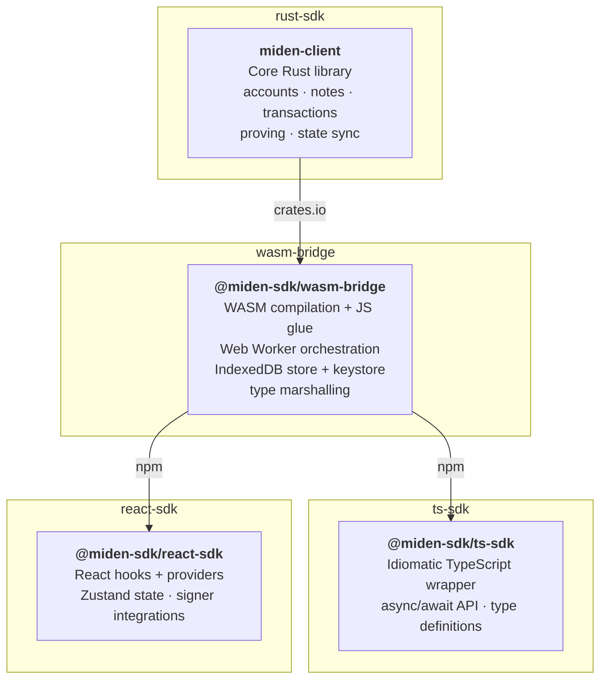

# Miden client

The Miden client SDK is organized as a layered stack. The Rust core is the single source of truth for all client logic. Browser-facing SDKs build on top of it through a WASM bridge layer, giving TypeScript and React developers native access to the full protocol without needing a Rust toolchain.

| Layer | Published as | Language | Purpose |
|-------|-------------|----------|---------|
| **[Rust SDK](./rust-client/index.md)** | `miden-client` (crates.io) | Rust | Core client library — account management, transaction building/execution/proving, state sync, node communication. `#![no_std]` compatible with trait-based DI for storage, RPC, proving, and key management |
| **WASM bridge** | `@miden-sdk/wasm-bridge` (npm) | Rust → WASM + JS | Compiles the Rust core to WebAssembly via `wasm-bindgen`. Manages Web Worker offloading, IndexedDB persistence, sync locking, and external signer support |
| **[TypeScript SDK](./web-client/index.md)** | `@miden-sdk/ts-sdk` (npm) | TypeScript | Pure TypeScript wrapper over the WASM bridge. Primary entry point for Node.js backends and non-React browser apps |
| **[React SDK](./react-client/index.md)** | `@miden-sdk/react-sdk` (npm) | TypeScript | React integration — hooks, context providers, Zustand state management, and wallet signer integrations |

The TypeScript and React SDKs are siblings — both consume the WASM bridge directly, neither depends on the other.
