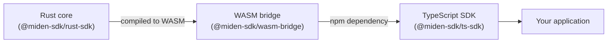
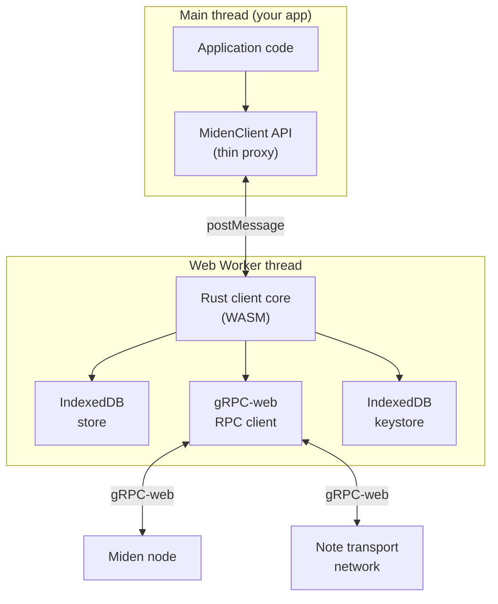
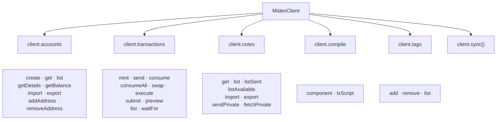
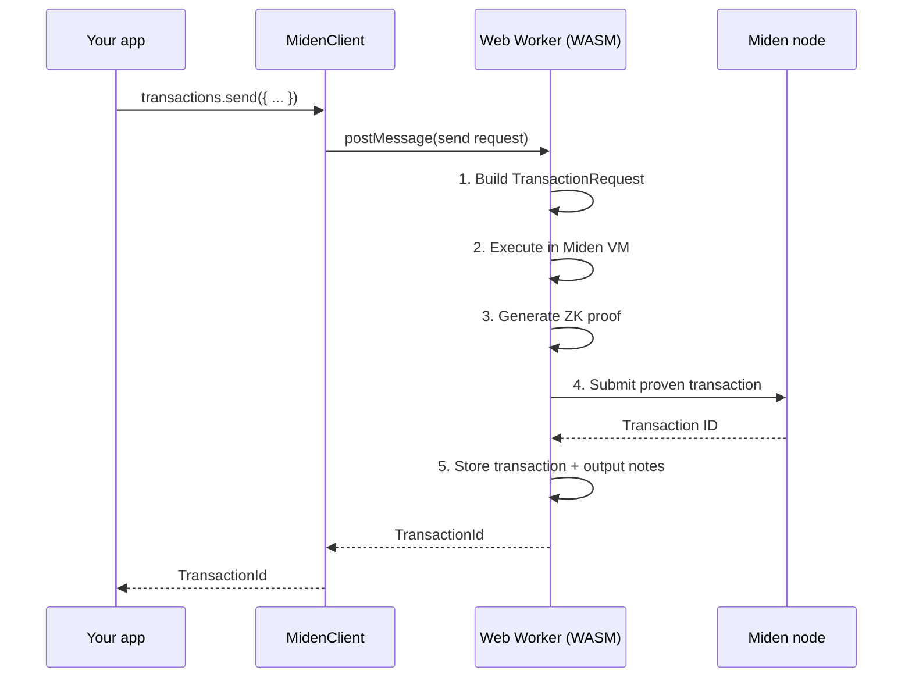

# Design

This page explains how the TypeScript SDK is structured and how its pieces fit together at runtime.

## How the SDK reaches the browser

The TypeScript SDK is a pure TypeScript package that wraps the [WASM bridge](../index.md) — a separate layer that compiles the [Rust client core](../rust-client/design.md) to WebAssembly and bundles it with browser infrastructure (Web Workers, IndexedDB, JS glue). The SDK itself contains no Rust or WASM code; it consumes the bridge as an npm dependency and provides the idiomatic TypeScript API you interact with.



From your perspective, `npm install` is all you need — the WASM binary, Web Worker script, and all bindings are bundled transitively.

## Runtime architecture

At runtime, the SDK splits work across two threads:



**Why a Web Worker?** Transaction proving and MASM compilation are CPU-intensive. Running them on the main thread would freeze the UI. The Web Worker keeps your application responsive while heavy operations run in the background.

Every `MidenClient` instance owns one Web Worker. The TypeScript API you interact with is a thin proxy that serializes calls to the worker via `postMessage` and returns the results as promises.

## Client API surface

The `MidenClient` exposes a resource-based API — each domain area is grouped under a namespace:



| Namespace | Responsibility |
|-----------|---------------|
| **`client.accounts`** | Account lifecycle: create wallets/faucets/contracts, retrieve state, check balances, import/export, manage addresses |
| **`client.transactions`** | Transaction lifecycle: build, execute, prove, submit, and track transactions. Supports mint, send, consume, swap, custom MASM scripts, and FPI |
| **`client.notes`** | Note management: list/filter input and output notes, import/export, send and fetch private notes via the note transport network |
| **`client.compile`** | MASM compilation: compile account components and transaction scripts in the browser, with library linking support |
| **`client.tags`** | Tag management: add/remove note tags that control which notes the client discovers during sync |
| **`client.sync()`** | State synchronization: pull the latest state from the Miden node and update local data |

Top-level methods like `client.exportStore()`, `client.importStore()`, and `client.terminate()` handle store backup/restore and worker lifecycle.

## Transaction lifecycle

When you call a high-level method like `client.transactions.send()`, the SDK handles the full lifecycle automatically:



Steps 2–3 are the most expensive. For complex transactions, you can offload proving to a remote prover by passing `proverUrl` at client creation or a `prover` per-transaction.

## Persistence

The SDK uses [IndexedDB](https://developer.mozilla.org/en-US/docs/Web/API/IndexedDB_API) for all browser-side persistence — no server or filesystem needed.

**Store** — persists the client's view of the blockchain:
- Account state (history, vault assets, code)
- Transactions and their scripts
- Input and output notes
- Note tags
- Block headers and chain data required for transaction execution

Because Miden supports off-chain execution and proving, the client only stores the blockchain history intervals relevant to its tracked accounts — not the entire chain.

**Keystore** — persists private keys for tracked accounts, stored separately from the main store. Keys are used to sign transactions during execution.

Both databases are scoped to the browser origin, so different domains cannot access each other's data.

## Network communication

The SDK communicates with two external services:

| Service | Protocol | Purpose |
|---------|----------|---------|
| **Miden node** | gRPC-web | Sync state, submit transactions, fetch public account data |
| **Note transport network** | gRPC-web | Exchange private notes between users |

Standard gRPC uses HTTP/2 features that browsers don't expose directly. The SDK uses [gRPC-web](https://github.com/grpc/grpc-web), which works over HTTP/1.1 and HTTP/2, making it compatible with browser environments. A gRPC-web proxy (like Envoy) may be required in front of the Miden node depending on the deployment.

## Resource management

Each `MidenClient` holds a Web Worker thread and IndexedDB connections. In long-running applications (e.g., a wallet that switches between networks), it's important to release these resources:

```typescript
// Explicit cleanup
client.terminate();

// Or automatic cleanup via TC39 Explicit Resource Management
{
  using client = await MidenClient.create();
  // client.terminate() called automatically at end of scope
}
```

After `terminate()`, all method calls throw `Error("Client terminated")`.
