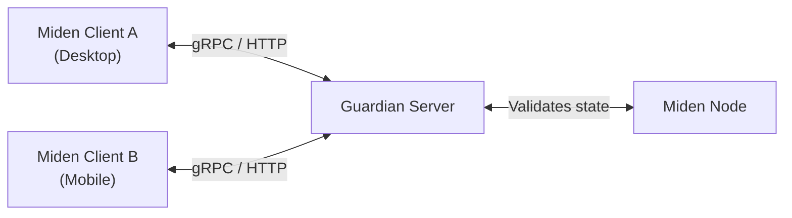
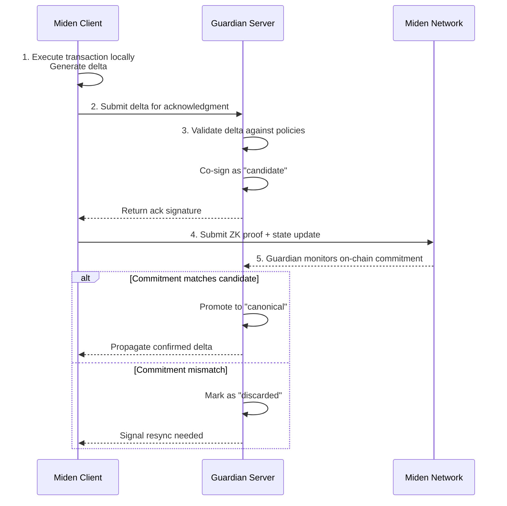
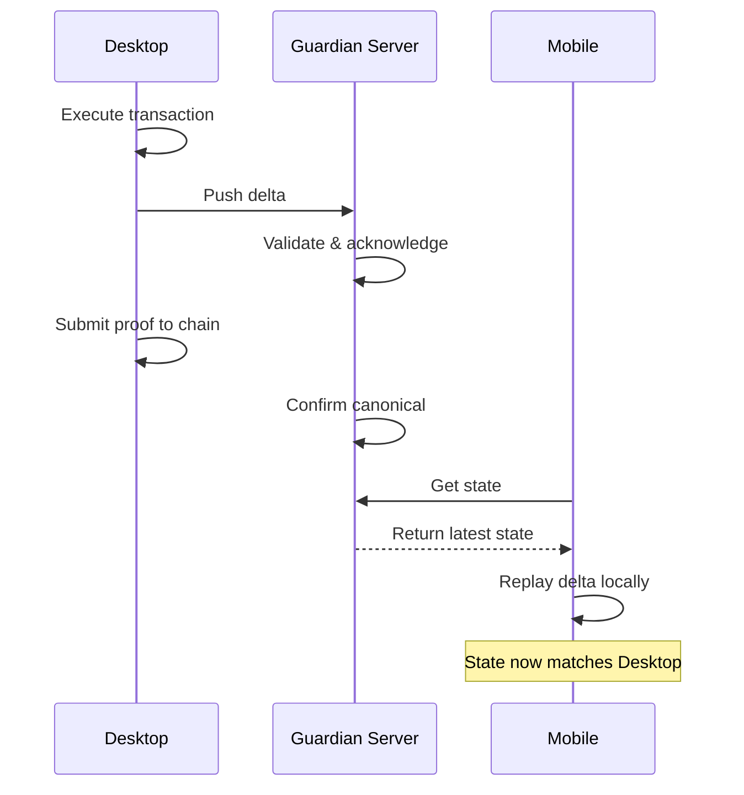
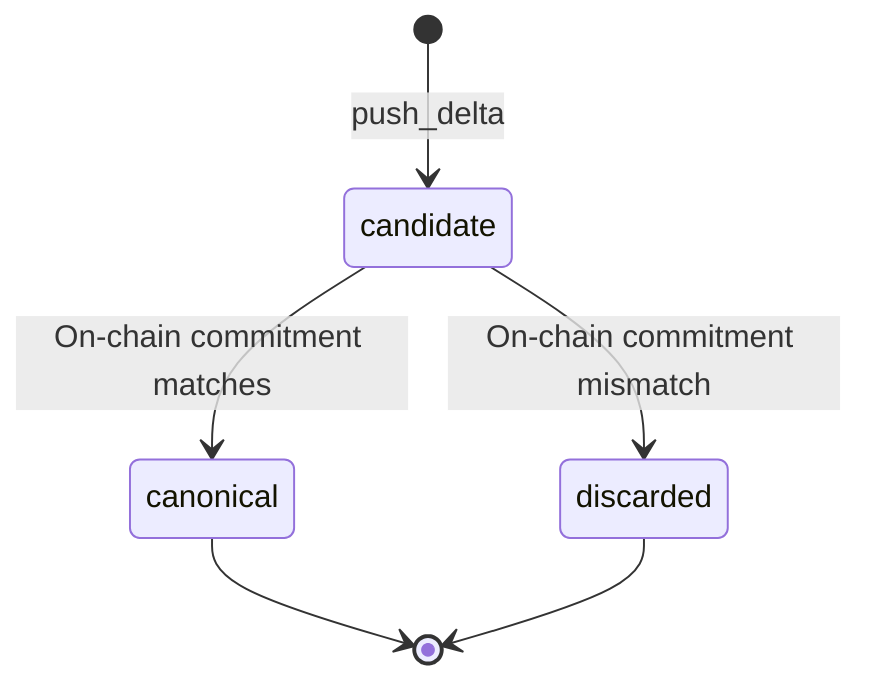

# Architecture

Guardian sits between Miden clients and the Miden network, providing an off-chain coordination layer for private account state.

## System overview

- **Miden Client** handles transaction execution, proving, and local state management.
- **Guardian Server** stores state snapshots and deltas, authenticates requests, validates changes against the network, and coordinates multi-party workflows.
- **Miden Node** is the network's RPC endpoint that Guardian validates state against.

Each account is independently configured on Guardian with its own authentication policy and storage. Clients interact with Guardian through either gRPC or HTTP — both interfaces expose the same semantics.

## End-to-end transaction flow

Transactions proceed through a step-by-step process to ensure consistency and verifiability:

1. **Local execution**: The user computes a transaction locally, generating a delta (state change).
2. **Delta submission**: The user sends the delta to Guardian for acknowledgment.
3. **Guardian acknowledgment**: Guardian validates the delta and co-signs it, designating it as a "candidate" state.
4. **Proof submission**: The user generates the ZK proof and submits it to the chain.
5. **Canonical confirmation**: Guardian monitors the chain. If the on-chain commitment matches the candidate, the state becomes "canonical" and is propagated to other devices or signers.

## Multi-device sync

For users with multiple devices, Guardian keeps state synchronized seamlessly:

The desktop executes a transaction and pushes the delta to Guardian. After on-chain confirmation, Guardian propagates the canonical delta to the mobile device, which replays it locally — all without querying the chain directly.

## Account management

Accounts are configured with per-account authentication based on public keys (commitments). During setup, Guardian records which keys are authorized to manage the account.

For each request, the client signs a payload with one of those keys and the server verifies the signature against the account's authorized keys. See [Components](./components.md) for details on the auth model.

## Canonicalization

Canonicalization is the process of validating that a state transition (delta) is valid against the on-chain commitment. It is optional and mainly used in multi-user setups.

- **Candidate mode** (default): A background worker promotes or discards deltas after a configurable delay and network verification.
- **Optimistic mode**: Deltas become canonical immediately, skipping the verification window.

| Parameter | Default | Description |
|---|---|---|
| `delay_seconds` | 900 (15 min) | How long a candidate waits before the worker checks it. |
| `check_interval_seconds` | 60 (1 min) | How often the worker runs. |

## Common use cases

- **Single-user accounts**: Back up and sync state securely. If a device is lost, recover state from Guardian.
- **Multi-user accounts**: Coordinate state and transactions between participants. Guardian helps keep everyone on the latest canonical state.
