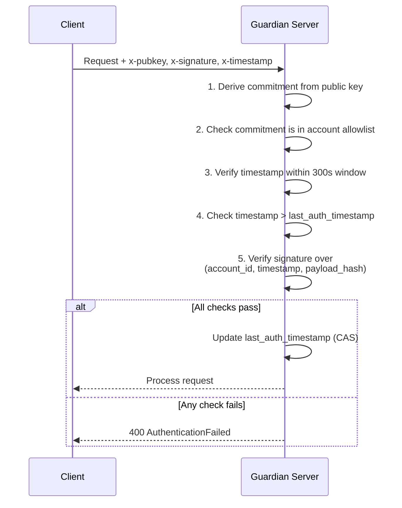

# Components

The Guardian server is composed of several pluggable components that handle different responsibilities.

## Component map

| Component | Responsibility | Operator concern |
|---|---|---|
| **API** | Exposes HTTP and gRPC routes for state, deltas, proposals, and server key discovery. | Transport exposure, CORS, request limits, rate limits. |
| **Auth** | Verifies per-account signatures and prevents replay. | Clock sync, key rotation, account metadata integrity. |
| **Acknowledger** | Signs accepted Miden deltas with the server acknowledgement key. | Keystore configuration, key persistence, key backup, `/pubkey` monitoring. |
| **Network** | Applies and verifies deltas against Miden network rules. | Correct network selection and configured RPC connectivity. |
| **Storage** | Persists state snapshots, deltas, and proposals. | Backend durability, access control, backups, migrations. |
| **Metadata** | Stores account config, auth policy, timestamps, and network config. | Consistency with account auth state and replay-protection durability. |
| **Operator dashboard** | Exposes operator-only views over accounts, deltas, proposals, and service status. | Operator authentication, session security, and access control. |

## API

The Miden state/delta API is exposed over HTTP and gRPC. The two transports use the same state, delta, proposal, and lookup semantics, so clients can switch between them without changing the underlying workflow.

**HTTP endpoints** (default port 3000):

| Method | Path | Description |
|---|---|---|
| `POST` | `/configure` | Create account with auth policy and initial state |
| `POST` | `/delta` | Push a delta (server validates, signs, sets status) |
| `GET` | `/delta?account_id&nonce` | Fetch delta by nonce |
| `GET` | `/delta/since?account_id&nonce` | Merged canonical snapshot since a nonce |
| `GET` | `/state?account_id` | Latest account state |
| `GET` | `/state/lookup?key_commitment` | Find accounts whose auth policy contains a key commitment |
| `POST` | `/delta/proposal` | Create pending proposal for multi-party signing |
| `GET` | `/delta/proposal?account_id` | List pending proposals |
| `GET` | `/delta/proposal/single?account_id&commitment` | Fetch one proposal |
| `PUT` | `/delta/proposal` | Append an authorized signature to a proposal |
| `GET` | `/pubkey` | Server acknowledgment public key (unauthenticated) |

`GET /state/lookup` returns `{ accounts: [{ account_id }] }`. A single key commitment may be authorized on multiple accounts, and an empty list is a successful "no matching account" response.

**gRPC** (default port 50051) mirrors the Miden state/delta surface above, including account lookup. Credentials are provided via metadata headers.

For the full API specification, see the [spec/api.md](https://github.com/OpenZeppelin/guardian/blob/main/spec/api.md) in the repository.

:::note
The Guardian repository also contains EVM proposal routes under `/evm/*`. Those routes are separate from the Miden state/delta flow described here, are HTTP-only, and are registered only when the server is built with the `evm` Cargo feature.
:::

## Auth

Request authentication is configured per account. All client-facing endpoints except `/pubkey` require authentication.

### Miden request signing

The current Miden authentication policies use an allowlist of authorized public-key commitments (`cosigner_commitments` in Guardian metadata). Guardian supports Miden Falcon RPO and Miden ECDSA commitments.

Every authenticated request includes three headers:

| Header | Description |
|---|---|
| `x-pubkey` | Signer's public key (full serialized key or 32-byte commitment hex) |
| `x-signature` | Signature over the Guardian request digest |
| `x-timestamp` | Unix timestamp in milliseconds |

For HTTP requests, the request payload digest is `RPO256` over canonical JSON bytes:

- `POST` and `PUT` sign the request body.
- `GET` signs the query object.

For gRPC requests, the request payload digest is `RPO256` over the protobuf-encoded request bytes.

The signed Miden message format is:

```
RPO256_hash([
  account_id_prefix,
  account_id_suffix,
  timestamp_ms,
  payload_hash_0,
  payload_hash_1,
  payload_hash_2,
  payload_hash_3
])
```

This binds the signature to the account, the timestamp, and the exact request payload.

### Lookup signing

`GET /state/lookup` is account-less because the caller is trying to discover which account IDs authorize a key commitment. It uses a dedicated domain-separated message:

```
RPO256_hash([DOMAIN_TAG_w0..w3, timestamp_ms, key_commitment_w0..w3])
```

The caller proves possession of the queried key commitment. The endpoint uses the same 300-second timestamp skew window, but it does not maintain a monotonic timestamp anchor because there is no account yet. The regular Miden request path tracks `last_auth_timestamp` per account.

### Verification flow



### Replay protection

Guardian prevents replay attacks through two mechanisms:

1. **Timestamp window**: The signed timestamp must be within **300 seconds** (5 minutes) of the server's current time.
2. **Monotonic timestamps**: Each request's timestamp must be strictly greater than the account's `last_auth_timestamp`, enforced atomically via compare-and-swap.

## Acknowledger

The Acknowledger produces tamper-evident acknowledgments for accepted deltas:

- Signs the digest of `new_commitment` and returns the signature as `ack_sig`.
- The server's acknowledgment key is exposed via the `/pubkey` endpoint for clients to cache and verify against.
- `/configure` returns both `ack_pubkey` and `ack_commitment` so clients can bind an account setup to the Guardian key they expect.

On first boot, Guardian creates the acknowledgement key if the configured keystore is empty. Operators still need to choose the keystore backend, persist it, back it up, and define a rotation playbook.

Clients should verify `ack_sig` after every `push_delta` to confirm the server processed the change correctly.

## Operator dashboard

Guardian also includes an operator dashboard API and TypeScript client for operational visibility into configured accounts, delta status, in-flight proposals, and service health. This surface is not part of the client state/delta API and should be protected as an operator-only interface.

## Network

The Network component handles interactions with the Miden blockchain:

- Computes commitments and validates deltas against the target network's rules.
- Validates account identifiers and request credentials against network-owned state.
- Merges multiple deltas into a single snapshot payload (for `get_delta_since`).
- Surfaces suggested auth updates (e.g., rotated authorized key commitments) so metadata remains aligned with the network.

Guardian does not trust client-provided network endpoints. Network identity is stored in account metadata, and operators configure the runtime network that Guardian validates against.

## Storage

Storage persists account snapshots, deltas, and delta proposals:

- Provides retrieval by account and nonce, plus range queries for canonicalization.
- Stores pending delta proposals in a per-account namespace keyed by proposal commitment.
- Backends are pluggable without altering API semantics.

Available backends:
- **Filesystem** (default): Stores data on disk. Suitable for **testing and development**. No external dependencies.
- **PostgreSQL** (optional): Recommended for **production** deployments. Requires the `postgres` feature flag at build time. Migrations run automatically on startup.

Because storage contains account state and delta payloads, operators should treat it as sensitive infrastructure. Use normal database controls: encrypted disks or managed database encryption, least-privilege credentials, backups, retention limits, and audit logging.

## Metadata

The Metadata store holds per-account configuration:

- `account_id`, authentication policy, `network_config`, storage backend type, timestamps, and `last_auth_timestamp` for replay protection.
- Supports CRUD operations and list iteration over accounts.
- Can use filesystem or PostgreSQL as its backing store, independent of the Storage backend choice.
