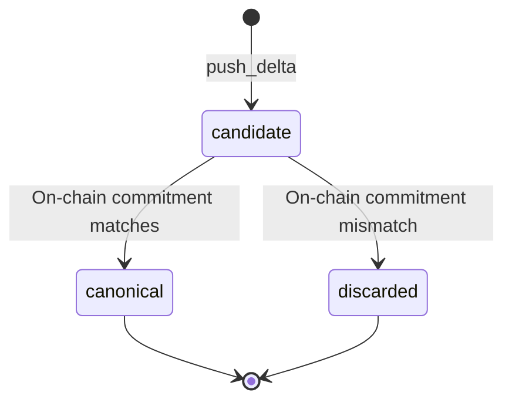
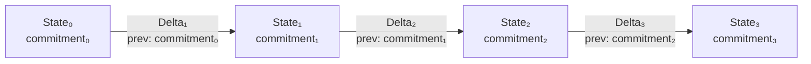
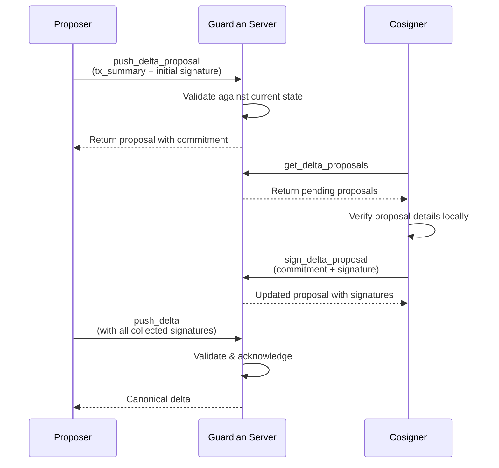

# Data Structures

Guardian models account state as an append-only chain of snapshots and changes.

## State

A **state** is a canonical snapshot of an account at a point in time. It includes the account's ID, commitment, nonce, vault (assets), storage, and other account data.

```json
{
  "account_id": "0xabc123...",
  "commitment": "0xdef456...",
  "nonce": 10,
  "assets": [
    { "balance": 12000, "asset_id": "USDC" },
    { "balance": 2, "asset_id": "ETH" }
  ]
}
```

When you first register an account with Guardian, you provide an **initial state** — the baseline from which all subsequent changes are tracked.

## Delta

A **delta** represents a set of changes applied to a state. Deltas are append-only — each delta references the commitment of the state it was applied to, forming an unbroken chain.

```json
{
  "account_id": "0xabc123...",
  "nonce": 11,
  "prev_commitment": "0xdef456...",
  "delta_payload": {
    "data": "<base64-encoded TransactionSummary>"
  }
}
```

A useful mental model: a delta is a compact, replayable description of "what changed" in an account's local state. Deltas can sync, back up, and reconstruct state without shipping full snapshots.

Key properties:

- **Ordered**: Each delta has a nonce that determines its position in the chain.
- **Linked**: The `prev_commitment` field references the state the delta was applied to. This prevents forks — if two deltas reference different base states, the server rejects the conflicting one.
- **Validated**: The server verifies each delta against the Miden network before accepting it.
- **Acknowledged**: Once accepted, the server signs the delta's `new_commitment`, providing cryptographic proof that it was processed.

### Delta status lifecycle

Each delta goes through a state machine:



| Status | Meaning |
|---|---|
| `candidate` | Accepted by Guardian but not yet verified on-chain. Awaiting canonicalization. |
| `canonical` | Verified against the network and permanently recorded. |
| `discarded` | Failed on-chain verification. Removed from the active delta chain. |

In **optimistic mode**, deltas skip the `candidate` stage and are immediately marked `canonical`.

## Commitments

A **commitment** is a cryptographic hash that uniquely identifies a particular version of an account's state. Commitments are the integrity backbone of Guardian:



- Each state snapshot has a commitment.
- Each delta includes a `prev_commitment` (the base state) and produces a `new_commitment` (the resulting state).
- The chain ensures that any tampering — inserting, reordering, or dropping deltas — is detectable by any client that tracks commitments.

## Delta proposals

A **delta proposal** is a coordination mechanism for multi-party accounts. When multiple signers must agree on a transaction:

1. **Propose**: One signer creates a delta proposal containing a `TransactionSummary`. Guardian validates the proposal against the current account state.
2. **Sign**: Other authorized cosigners fetch the pending proposal, verify it locally, and submit their signatures.
3. **Execute**: Once enough signatures are collected (meeting the threshold), any cosigner can promote the proposal to a canonical delta via `push_delta`.



Proposals remain in `pending` status until promoted. Once the corresponding delta becomes canonical, the proposal is automatically cleaned up.

Delta proposals have their own commitment, derived from `(account_id, nonce, tx_summary)`, used as a stable identifier.
