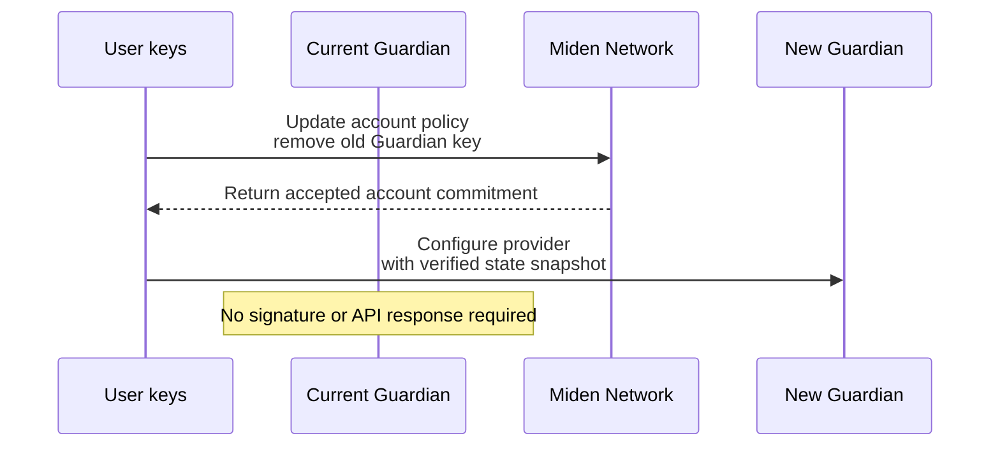
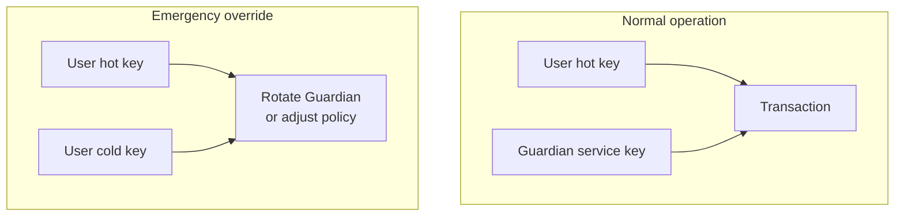

Guardian stores and relays account state for clients. It is not a custodian, and it is not a private execution environment.

## Trust model

Guardian is an availability and coordination service. Miden remains authoritative for account commitments, and users keep the keys required to recover or rotate providers.

| Area | Guardian role | Client or user responsibility |
|---|---|---|
| State sync | Stores and relays submitted state, deltas, proposals, metadata, and timestamps. | Verify returned commitments before relying on state. |
| Request auth | Authenticates account requests and rejects stale or conflicting deltas. | Keep user signing keys secure and resync before signing stale state. |
| Acknowledgements | Signs accepted deltas with the Guardian acknowledgement key. | Verify `/pubkey`, `ack_sig`, and delta ordering. |
| Account policy | May participate as one signer in a multi-key account policy. | Keep a user-controlled recovery path that can remove or replace Guardian. |
| Privacy and availability | Can see submitted payloads and access patterns, and can deny or delay service. | Treat Guardian as an operator-visible availability service. |

Guardian should not be trusted to move funds on its own, change the account commitment accepted by Miden, hide submitted data from the operator, or guarantee availability.

:::important
**User-controlled rotation.** Users can rotate Guardian at any time through their own recovery path. The current Guardian does not sign the rotation and does not need to serve an API response for it.
:::

## User control and provider rotation

In the standard assisted-custody setup, the account policy includes a user-controlled recovery path, such as user hot key + user cold key. This lets the user remove or replace Guardian without the current Guardian participating.

The current Guardian does not sign the rotation and does not need to serve an API response for it. The user updates the account policy to remove the old Guardian key commitment, adds the new Guardian if needed, and configures the new provider with a verified state snapshot.

## Client checks

Clients should verify:

1. The expected Guardian acknowledgement key from `/pubkey`.
2. `ack_sig` on accepted deltas.
3. Delta ordering through `prev_commitment` and `new_commitment`.
4. The latest account commitment against Miden before recovery, provider rotation, or high-value signing.
5. Fresh state before signing if another client or authorized signer may have advanced the account.

## Common 2-of-3 setup

A common Guardian configuration uses a **2-of-3** threshold embedded in the account's authentication code:

| Key | Holder | Purpose |
|---|---|---|
| **Key 1** | User hot key | Daily transactions |
| **Key 2** | User cold key | Recovery and emergency override |
| **Key 3** | Guardian service key | Co-signing and policy enforcement |

Normal transactions can use the hot key plus Guardian. Emergency actions can use the hot key plus cold key, without Guardian involvement.
