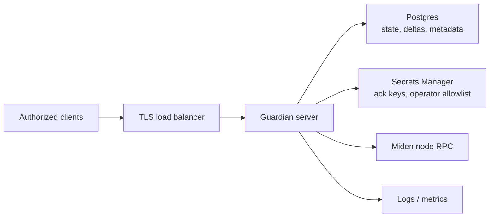

# Deploying Miden Guardian

The repository deploy script provisions and updates the AWS infrastructure used by the reference Guardian deployment. Operators on other platforms can run the same server binary with the same environment variables - adapt the surrounding services to taste.

:::warning
Guardian stores private account state and delta payloads submitted by clients. Treat the deployment like sensitive wallet infrastructure even though Guardian is non-custodial.
:::

The reference AWS deployment uses:

- ECS / Fargate
- Application Load Balancer
- RDS Postgres
- Secrets Manager (env vars + ack keys)
- ECR for container images
- CloudWatch for logs

## Deployment architecture



Production deployments should make the trust boundary explicit:

| Boundary | Production expectation |
|---|---|
| Client traffic | TLS termination, explicit CORS allowlist for browser clients, request-size limits, rate limits. |
| Guardian server | Reproducible build hash recorded, minimal IAM permissions, no shell access for normal operation. |
| Database | Managed Postgres, encrypted storage, backups, migration visibility, least-privilege credentials. |
| Ack keys | Generated once per environment, stored in Secrets Manager, monitored for unexpected rotation. |
| Node RPC | Explicit network target; do not accept client-provided RPC endpoints. |
| Logs | Avoid logging full state or delta payloads. Retain enough metadata for debugging canonicalization failures. |

## AWS deploy script

```bash
DEPLOY_STAGE=dev \
GUARDIAN_NETWORK_TYPE=MidenTestnet \
./scripts/aws-deploy.sh deploy
```

```bash
DEPLOY_STAGE=dev ./scripts/aws-deploy.sh status
DEPLOY_STAGE=dev ./scripts/aws-deploy.sh logs
```

Before serving production traffic, bootstrap the acknowledgement keys:

```bash
DEPLOY_STAGE=prod ./scripts/aws-deploy.sh bootstrap-ack-keys
```

`bootstrap-ack-keys` runs the `ack-keygen` binary to generate fresh Falcon and ECDSA secret keys, then writes them to AWS Secrets Manager as `guardian-prod/server/ack-falcon-secret-key` and `guardian-prod/server/ack-ecdsa-secret-key`. It refuses to overwrite either secret if it already exists, so re-running on a deployed environment is safe.

## Environment variables

### Core

| Var                       | Default                                                          | Notes                                                                                                       |
| ------------------------- | ---------------------------------------------------------------- | ----------------------------------------------------------------------------------------------------------- |
| `GUARDIAN_NETWORK_TYPE`   | `MidenDevnet` (binary) · `MidenTestnet` (deploy script)          | Set explicitly for production.                                                                              |
| `GUARDIAN_ENV`            | unset                                                            | When `prod`, ack keys are loaded from AWS Secrets Manager; otherwise from the filesystem keystore.          |
| `AWS_REGION`              | `us-east-1` (deploy script)                                      | Required at runtime when `GUARDIAN_ENV=prod`.                                                               |
| `DATABASE_URL`            | none                                                             | Required for Postgres builds. Server panics on startup if missing.                                          |
| `GUARDIAN_STORAGE_PATH`   | `/var/guardian/storage`                                          | Filesystem-mode account state.                                                                              |
| `GUARDIAN_METADATA_PATH`  | `/var/guardian/metadata`                                         | Filesystem-mode metadata (auth timestamps, proposals).                                                      |
| `GUARDIAN_KEYSTORE_PATH`  | `/var/guardian/keystore`                                         | Filesystem-mode key material when `GUARDIAN_ENV` ≠ `prod`.                                                  |
| `RUST_LOG`                | `info` is a sensible baseline                                    | Standard `tracing-subscriber` filter syntax.                                                                |

Filesystem storage is the default local backend; the `postgres` feature with a valid `DATABASE_URL` switches the storage and metadata stores to Postgres.

### Limits and rate-limiting

| Var                                          | Default     | AWS prod override |
| -------------------------------------------- | ----------- | ----------------- |
| `GUARDIAN_RATE_LIMIT_ENABLED`                | `true`      | -                 |
| `GUARDIAN_RATE_BURST_PER_SEC`                | `10`        | `200`             |
| `GUARDIAN_RATE_PER_MIN`                      | `60`        | `5000`            |
| `GUARDIAN_MAX_REQUEST_BYTES`                 | `1048576`   | -                 |
| `GUARDIAN_MAX_PENDING_PROPOSALS_PER_ACCOUNT` | `20`        | -                 |
| `GUARDIAN_DB_POOL_MAX_SIZE`                  | `16`        | `32`              |
| `GUARDIAN_METADATA_DB_POOL_MAX_SIZE`         | (matches storage pool) | -      |

Rate limiting is on by default; pass `0`, `false`, `no`, or `off` to `GUARDIAN_RATE_LIMIT_ENABLED` to disable. Invalid values for `GUARDIAN_MAX_REQUEST_BYTES` are silently ignored - the default is used.

### Operator allowlist + CORS

| Var                                       | Notes                                                                                                              |
| ----------------------------------------- | ------------------------------------------------------------------------------------------------------------------ |
| `GUARDIAN_OPERATOR_PUBLIC_KEYS_SECRET_ID` | AWS Secrets Manager secret ID containing the allowlist; requires `AWS_REGION`. Set automatically by the AWS Terraform. |
| `GUARDIAN_OPERATOR_PUBLIC_KEYS_FILE`      | Filesystem alternative when not on AWS.                                                                            |
| `GUARDIAN_CORS_ALLOWED_ORIGINS`           | Comma-separated origin list. Unset = allow any origin without credentials. Wildcard `*` is rejected when credentialed origins are configured. |

## Canonicalization

The server runs a canonicalization pass every **10 seconds** with a **10-minute** submission grace period. Both values are hard-coded in `crates/server/src/main.rs` and are **not** configurable via environment variable - embedders that need different timing must call the builder API in code.

Operators should monitor:

- candidate deltas older than the grace period,
- discarded deltas,
- repeated canonicalization failures for the same account,
- Miden node RPC failures,
- acknowledgement key changes,
- database write latency and migration failures.

## Reproducible builds

```bash
./crates/server/verify-build-hash.sh
```

The script must run inside a git checkout of the repo with a `Dockerfile` at the root. It builds the server image, copies the resulting `/app/server` binary out, and prints its SHA256, size, and the source commit. Uncommitted local changes produce a warning but do not fail the script.

Record the output with the deployment change. It gives operators and integrators a concrete artifact to compare when debugging or auditing a running Guardian instance.
