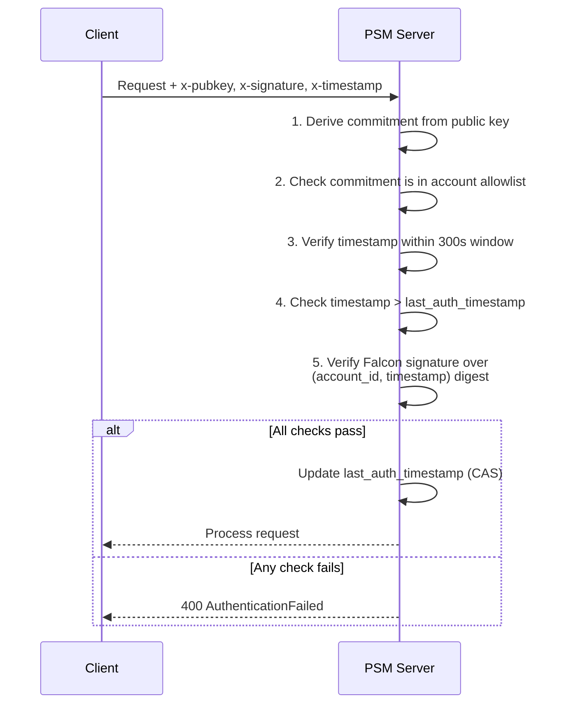

# Authentication

All PSM endpoints (except the public key discovery endpoint) require per-request authentication. PSM uses Falcon RPO signatures — the same signature scheme used by Miden accounts — to authenticate requests.

## Request signing

Every authenticated request must include three headers:

| Header | Description |
|---|---|
| `x-pubkey` | The signer's public key (full serialized key or 32-byte commitment hex) |
| `x-signature` | Falcon RPO signature over the request digest |
| `x-timestamp` | Unix timestamp in milliseconds |

The signature is computed over the following digest:

```
RPO256_hash([account_id_prefix, account_id_suffix, timestamp_ms, 0])
```

The same headers are used for both HTTP and gRPC (as metadata keys).

### Falcon public key formats

The `x-pubkey` header accepts two formats:

- **Full public key**: The complete serialized Falcon public key bytes.
- **Commitment hex**: A `0x`-prefixed 64-character hex string representing the 32-byte commitment of the public key. The actual public key is recovered from the Falcon signature during verification.

## Cosigner allowlists

Each account is configured with an authentication policy that specifies which public keys are authorized. For `MidenFalconRpo` accounts, this is a list of **cosigner commitments** — hashes of the authorized public keys.

```json
{
  "auth": {
    "MidenFalconRpo": {
      "cosigner_commitments": [
        "0x<commitment-of-pubkey-1>",
        "0x<commitment-of-pubkey-2>"
      ]
    }
  }
}
```

When a request arrives, the server verifies the credentials:



Only requests from keys in the allowlist are accepted.

## Replay protection

PSM prevents replay attacks through two mechanisms:

1. **Timestamp window**: The signed timestamp must be within **300 seconds** (5 minutes) of the server's current time. Requests outside this window are rejected.
2. **Monotonic timestamps**: The server tracks a `last_auth_timestamp` per account. Each request's timestamp must be strictly greater than the last accepted timestamp. This is enforced atomically using compare-and-swap.

Together, these ensure that even if an attacker captures a valid signed request, it cannot be replayed after the original has been processed.

## Server acknowledgement

After accepting a delta, the server signs the resulting `new_commitment` with its own key. This acknowledgement signature (`ack_sig`) is returned in the response.

Clients should verify this signature against the server's public key (available at the `/pubkey` endpoint) to confirm the server processed the delta correctly. This provides cryptographic proof that the server has committed to the new state.

```bash
# Retrieve the server's acknowledgement public key
curl http://localhost:3000/pubkey
# Returns: { "pubkey": "0x..." }
```
