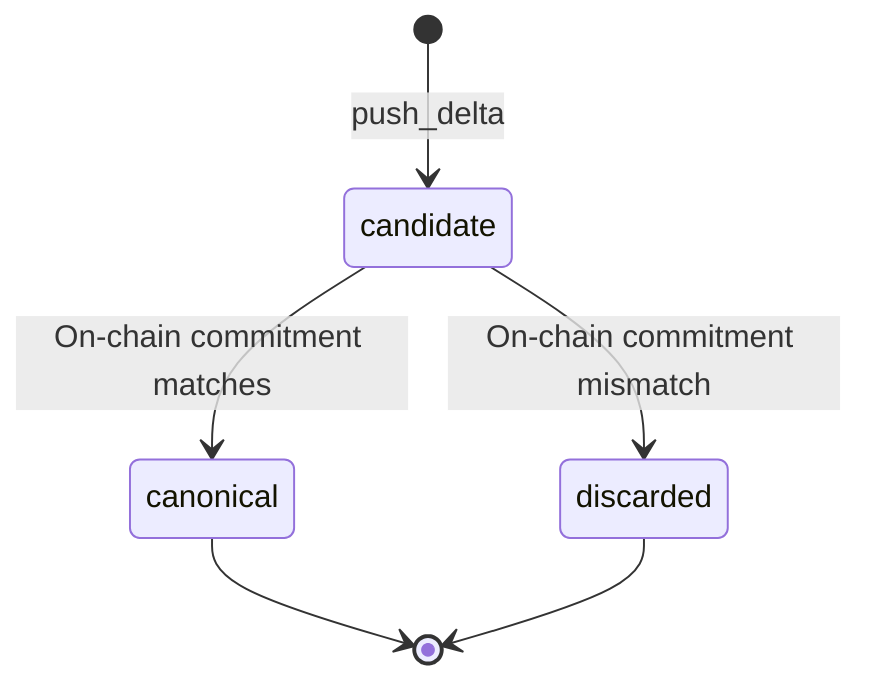
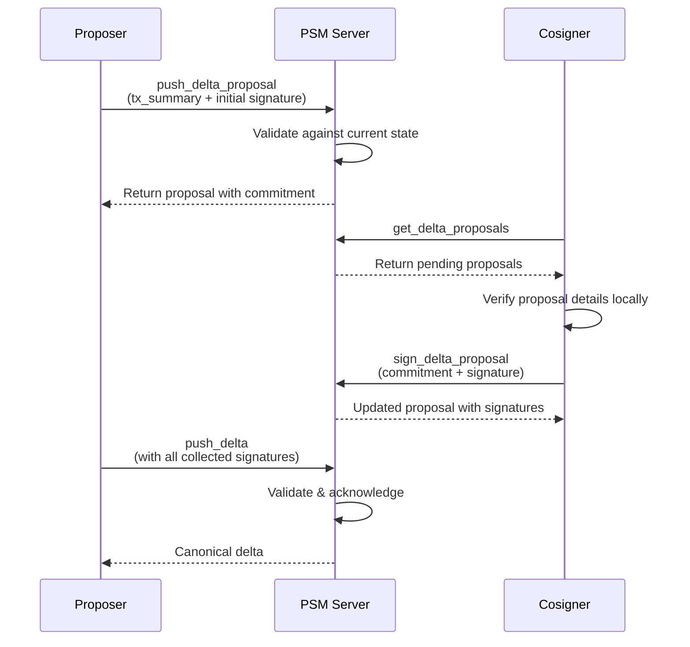
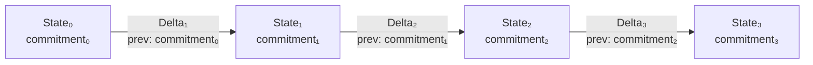
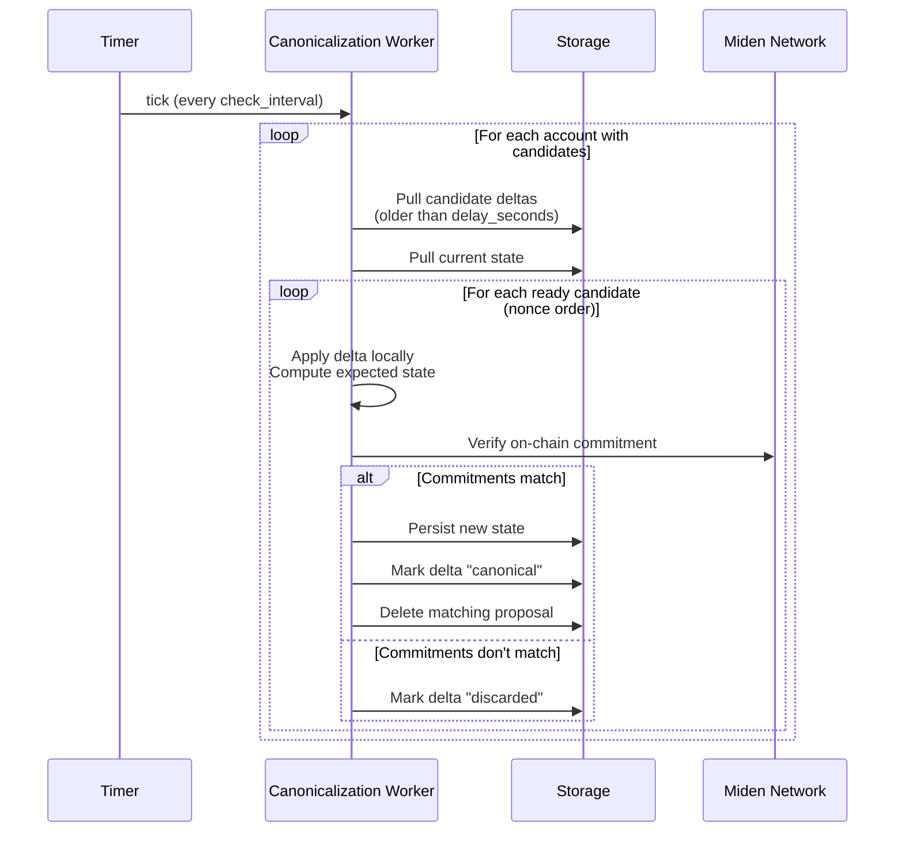

# Core Concepts

PSM is built around a small set of concepts that work together to provide secure, append-only state management.

## State

A **state** is a snapshot of an account at a specific point in time. It includes the account's assets, nonce, storage, and a cryptographic commitment that uniquely identifies this version of the state.

```json
{
  "account_id": "0xabc123...",
  "commitment": "0xdef456...",
  "nonce": 10,
  "assets": [
    { "balance": 12000, "asset_id": "USDC" },
    { "balance": 2, "asset_id": "ETH" }
  ]
}
```

When you first register an account with PSM, you provide an **initial state** — the baseline from which all subsequent changes are tracked.

## Deltas

A **delta** represents a set of changes applied to a state. Deltas are append-only — each delta references the commitment of the state it was applied to, forming an unbroken chain.

```json
{
  "account_id": "0xabc123...",
  "nonce": 11,
  "prev_commitment": "0xdef456...",
  "ops": [
    { "type": "transfer", "asset_id": "USDC", "amount": 100 }
  ]
}
```

One useful mental model: a delta is a compact, replayable description of "what changed" in an account's local state. Deltas can be used to sync, back up, and reconstruct state without shipping full snapshots.

Key properties of deltas:

- **Ordered**: Each delta has a nonce that determines its position in the chain.
- **Linked**: The `prev_commitment` field references the state the delta was applied to. This prevents forks — if two deltas reference different base states, the server rejects the conflicting one.
- **Validated**: The server verifies each delta against the Miden network before accepting it.
- **Acknowledged**: Once accepted, the server signs the delta's new commitment, providing cryptographic proof that it was processed.

### Delta lifecycle

Each delta goes through a state machine:



| Status | Meaning |
|---|---|
| `candidate` | Accepted by PSM but not yet verified on-chain. Awaiting canonicalization. |
| `canonical` | Verified against the network and permanently recorded. |
| `discarded` | Failed on-chain verification. Removed from the active delta chain. |

In **optimistic mode**, deltas skip the `candidate` stage and are immediately marked `canonical`.

## Delta proposals

A **delta proposal** is a coordination mechanism for multi-party accounts. When multiple signers must agree on a transaction, the workflow is:

1. **Propose**: One signer creates a delta proposal containing a transaction summary. PSM validates the proposal against the current account state.
2. **Sign**: Other authorized cosigners fetch the pending proposal, verify it locally, and submit their signatures to PSM.
3. **Execute**: Once enough signatures are collected (meeting the account's threshold), any cosigner can promote the proposal to a canonical delta by calling `push_delta` with the collected signatures.



Proposals remain in `pending` status until promoted or deleted. Once the corresponding delta becomes canonical, the proposal is automatically cleaned up.

## Commitments

A **commitment** is a cryptographic hash that uniquely identifies a particular version of an account's state. Commitments serve as the integrity backbone of PSM:



- Each state snapshot has a commitment.
- Each delta includes a `prev_commitment` (the state it was applied to) and produces a `new_commitment` (the resulting state).
- Delta proposals have their own commitment, derived from `(account_id, nonce, tx_summary)`, used as a stable identifier.

The commitment chain ensures that any tampering with state history — inserting, reordering, or dropping deltas — is detectable by any client that tracks commitments.

## Canonicalization

**Canonicalization** is the background process that promotes candidate deltas to canonical status by verifying them against the Miden network.



When canonicalization is enabled:

1. A `push_delta` stores the delta as a `candidate`.
2. A background worker periodically checks candidates that have been pending for at least the configured delay (default: 15 minutes).
3. The worker applies the delta locally, computes the expected state, and verifies the resulting commitment against the on-chain state.
4. If the commitments match, the delta is promoted to `canonical` and the account's stored state is updated.
5. If they don't match, the delta is marked `discarded`.

This provides a safety window where invalid or conflicting deltas can be caught before they become part of the permanent record.

### Configuration

| Parameter | Default | Description |
|---|---|---|
| `delay_seconds` | 900 (15 min) | How long a candidate must wait before the worker checks it. |
| `check_interval_seconds` | 60 (1 min) | How often the worker runs. |
