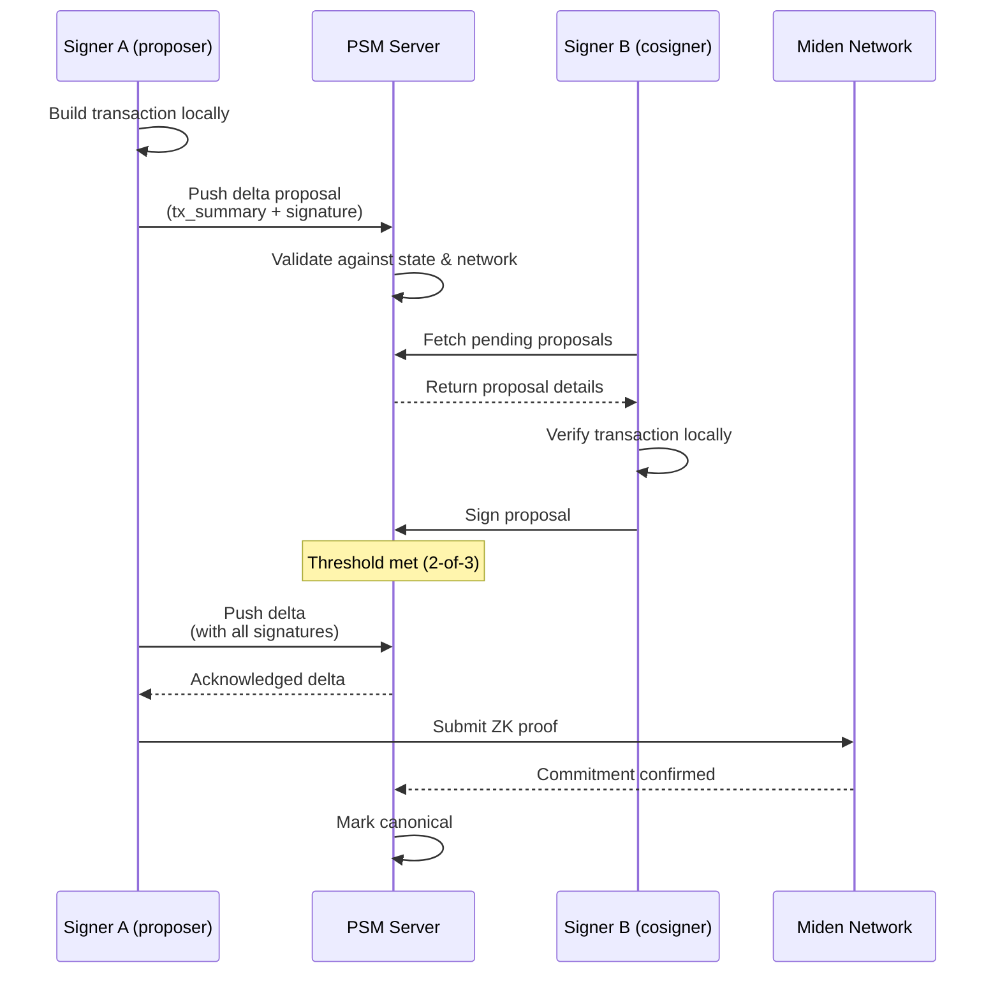
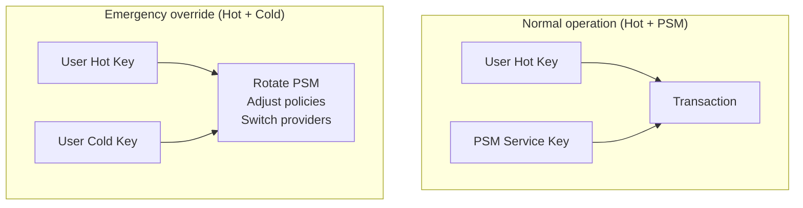
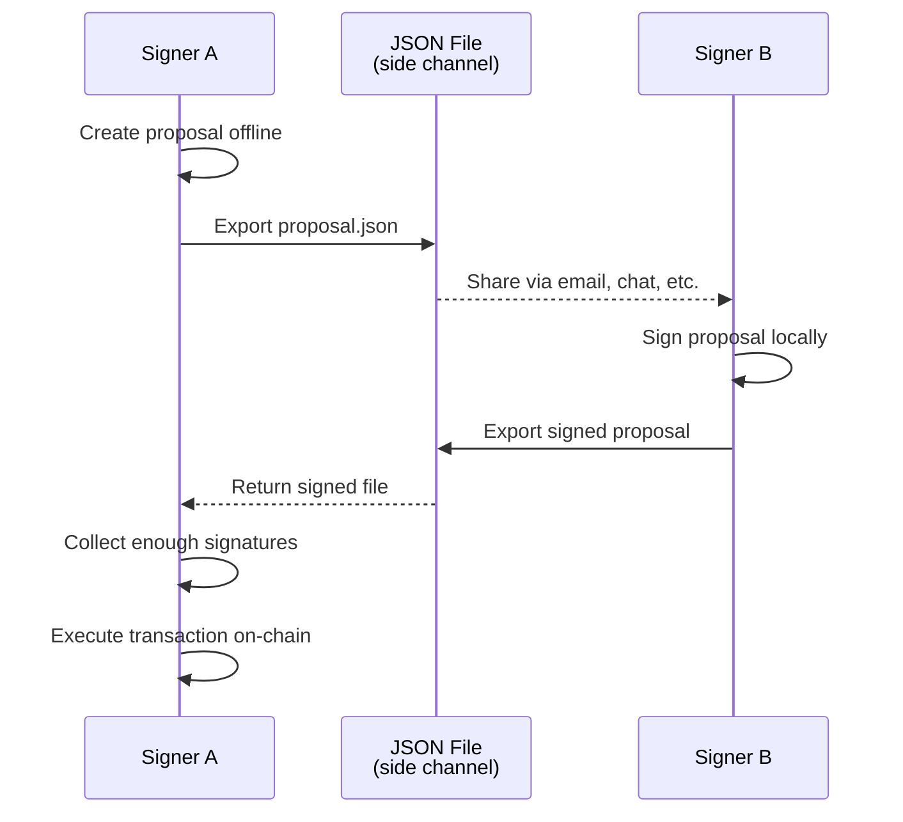

# MultiSig on Miden

Miden multisig accounts allow multiple parties to collectively control an account, requiring a configurable threshold of signatures (N-of-M) to execute transactions. PSM provides the coordination layer that makes this possible without revealing private state to a centralized server.

## How it works

Miden multisig accounts store their authentication logic on-chain, but **their state — signers, metadata, proposals — is kept private**. PSM acts as the coordination server:

1. **Propose**: A signer creates a transaction proposal and pushes it to PSM as a delta proposal. PSM validates the proposal against the current account state and the Miden network.
2. **Sign**: Other authorized cosigners fetch the pending proposal from PSM, verify the transaction details locally, and submit their signatures.
3. **Execute**: Once the threshold is met, any cosigner builds the final transaction using all collected signatures plus the PSM acknowledgement, and submits it on-chain.

## Key architecture: 2-of-3 non-custodial setup

A common multisig configuration uses a 2-of-3 threshold:

| Key | Holder | Purpose |
|---|---|---|
| **Key 1** | User hot key | Daily transactions |
| **Key 2** | User cold key | Recovery and emergency override |
| **Key 3** | PSM service key | Co-signing and policy enforcement |

- **Normal operations**: The hot key plus PSM's co-signature are sufficient. PSM verifies the signer is working from the latest state and checks any configured policies.
- **Emergency override**: The hot and cold keys alone can rotate out PSM, adjust policies, or switch providers — ensuring the user always retains ultimate control.
- **PSM alone cannot move funds**: It holds only one key and needs the user's key to co-sign any transaction.

## Transaction types

The multisig SDKs support these transaction types:

| Type | Description |
|---|---|
| **Transfer (P2ID)** | Send assets to another account |
| **Consume notes** | Spend incoming notes |
| **Add signer** | Add a new cosigner to the multisig account |
| **Remove signer** | Remove a cosigner |
| **Change threshold** | Update the required signature count |
| **Switch PSM** | Change the PSM provider endpoint |

## Offline fallback

If the PSM server is unreachable, the SDKs support offline workflows:

1. Create a proposal locally and export it as a JSON file.
2. Share the file with cosigners through any side channel.
3. Each cosigner signs the proposal offline and returns the signed file.
4. Once enough signatures are collected, execute the transaction.

This ensures multisig operations remain functional even without PSM connectivity.

## Client SDKs

Both Rust and TypeScript SDKs wrap the multisig contracts and PSM coordination into a high-level API:

import DocCard from '@theme/DocCard';

  

    <DocCard
      item={{
        type: 'link',
        href: './rust-client',
        label: 'Rust Client',
        description: 'miden-multisig-client — Rust SDK for multisig workflows.',
      }}
    />
  

  

    <DocCard
      item={{
        type: 'link',
        href: './typescript-client',
        label: 'TypeScript Client',
        description: '@openzeppelin/miden-multisig-client — TypeScript SDK for multisig workflows.',
      }}
    />
  

## Reference application

The [MultiSig reference application](https://github.com/OpenZeppelin/MultiSig) demonstrates a complete multisig deployment with a Next.js frontend, PSM integration, and support for multiple wallet types (local keys, Para, Miden Wallet).
