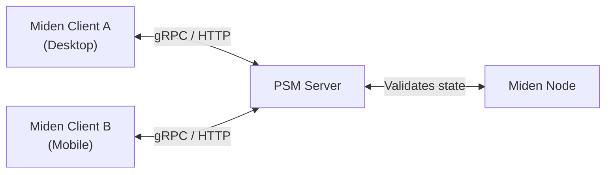
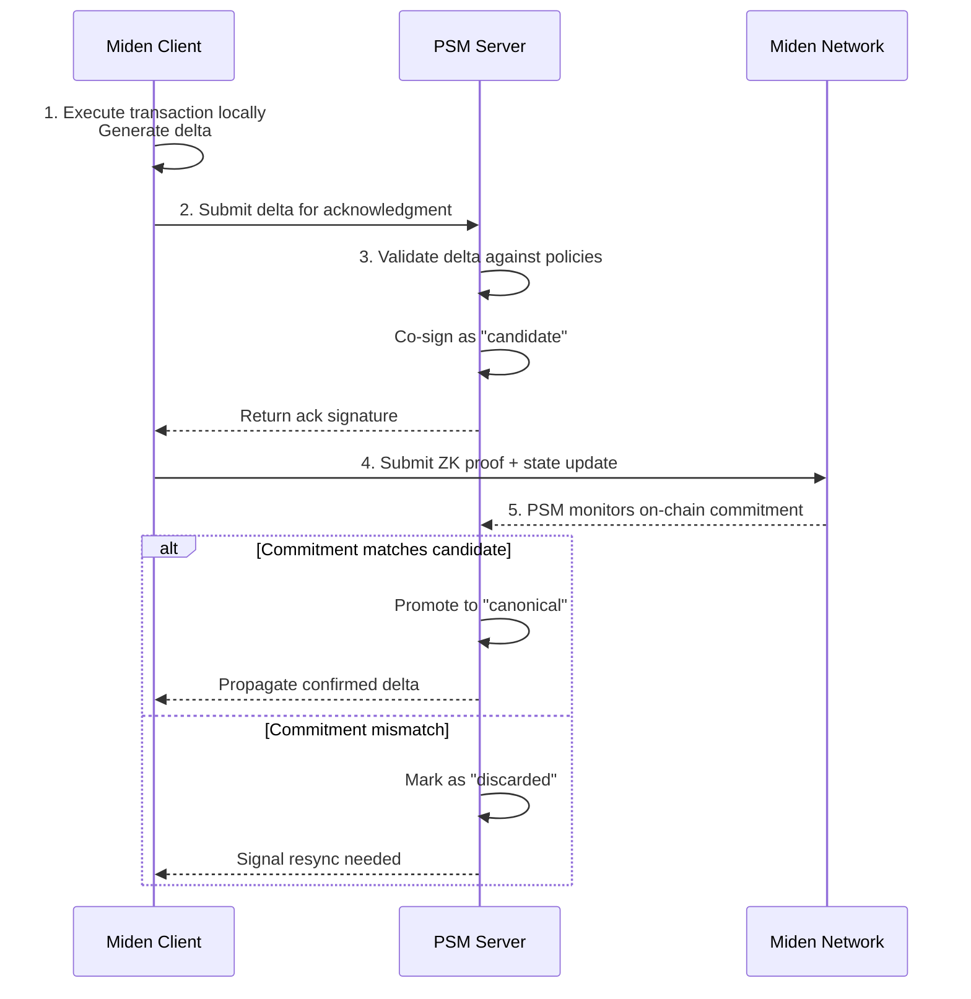
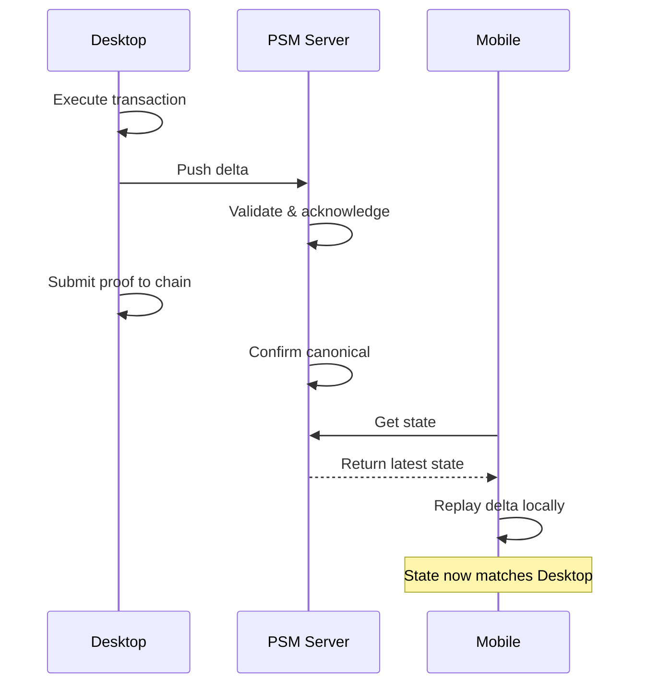

# What is the Private State Manager?

Miden uses client-side execution — transactions are built and proven locally on user devices. This means account state lives on the client, not on a centralized server. While this gives users full control over their data, it introduces practical challenges:

- **Backup**: If a device is lost, so is the account state.
- **Multi-device sync**: A user with a phone and laptop needs both devices to see the same account state.
- **Multi-party coordination**: Multisig accounts require multiple signers to agree on state changes before they can be submitted on-chain.

On public chains, the ledger is a universally readable source of truth — every device and every signer can independently observe the latest state. In a private account model, the canonical state is defined by the on-chain commitment, but it isn't readable in a way that automatically keeps every device and signer up to date. The coordination surface moves off-chain.

The Private State Manager (PSM) solves these problems. It is a server that stores account state and coordinates state changes across devices and parties — without the server operator ever gaining the ability to forge or tamper with the state.

## Architecture

PSM sits between Miden clients and the Miden network:

- **Miden Client** handles transaction execution, proving, and local state management.
- **PSM Server** stores state snapshots and deltas, authenticates requests, validates changes against the network, and coordinates multi-party workflows.
- **Miden Node** is the network's RPC endpoint that PSM validates state against.

Each account is independently configured on PSM with its own authentication policy and storage. Clients interact with PSM through either gRPC or HTTP — both interfaces expose the same semantics.

## How transactions flow

Transactions proceed through a step-by-step process to ensure consistency and verifiability:

1. **Local execution**: The user computes a transaction locally, generating a delta (state change).
2. **Delta submission**: The user sends the delta to PSM for acknowledgment.
3. **PSM acknowledgment**: PSM validates the delta and co-signs it, designating it as a "candidate" state.
4. **Proof submission**: The user (or PSM in advanced configurations) generates the ZK proof and submits it to the chain.
5. **Canonical confirmation**: PSM monitors the chain. If the on-chain commitment matches the candidate, the state becomes "canonical" and is propagated to other devices or signers.

## Multi-device sync

For users with multiple devices, PSM makes synchronization seamless:

The desktop executes a transaction and pushes the delta to PSM. After on-chain confirmation, PSM propagates the canonical delta to the mobile device, which replays it locally to update its state — all without querying the chain directly.

## Trust model

PSM is designed to minimize trust in the server operator:

- **Integrity**: Every delta references the previous state commitment. The server cannot silently insert, reorder, or drop deltas without breaking the commitment chain.
- **Acknowledgement**: The server signs each accepted delta with its own key. Clients can verify these signatures to confirm the server processed their changes.
- **Authentication**: Only authorized parties (listed in the account's cosigner allowlist) can read or write state. Authentication uses Falcon RPO signatures with replay protection.
- **Network validation**: The server validates deltas against the Miden network's state, ensuring changes are consistent with on-chain reality.

The server _can_ refuse to serve data (denial of service), but it cannot forge state or silently corrupt an account's history. If the provider goes rogue or disappears, users with their own keys can recover independently.

### Non-custodial multisig setup

A common PSM configuration uses a **2-of-3** threshold embedded in the account's authentication code:

| Key | Holder | Purpose |
|---|---|---|
| **Key 1** | User hot key | Daily transactions |
| **Key 2** | User cold key | Recovery and emergency override |
| **Key 3** | PSM service key | Policy enforcement and co-signing |

In normal operations, the hot key plus PSM's co-signature suffice. For emergencies, the hot and cold keys alone can rotate out PSM, adjust policies, or switch providers — ensuring the user always retains ultimate control.

## Use cases

| Use case | How PSM helps |
|---|---|
| **State backup** | Account state is stored on PSM, recoverable even if a device is lost. |
| **Multi-device sync** | Multiple devices push and pull state through PSM, staying in sync. |
| **Multi-party coordination** | Multisig accounts use delta proposals to coordinate threshold signing across participants. |
| **Safety controls** | PSM can enforce rate limits, timelocks, and emergency freezes as a co-signer. |
| **Compliance** | Providers can screen transactions against sanctions lists and produce ZK compliance proofs on demand. |
| **Audit trail** | The append-only delta chain provides a verifiable history of all state changes. |

### Device recovery example

Without PSM, losing a device means falling back to a cold backup and losing any state changes since the last checkpoint. With PSM:

1. The user opens their remaining device — it already has the latest state, synced through PSM.
2. The user initiates a hot key rotation using their cold key.
3. The stolen device's keys become invalid. Recovery takes minutes, not days.

### PSM evolution

PSM is designed to grow with the ecosystem:

- **Phase I — Backup and sync**: State backup, multi-device synchronization, and basic multisig coordination.
- **Phase II — Safety and compliance**: Rate limits, timelocks, emergency freezes, sanctions screening, and ZK compliance proofs.
- **Phase III — Institutional rails**: Delegated proving, batch settlement, ephemeral note netting, and cross-provider coordination for institutional-scale operations.
