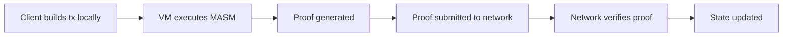

# How Miden Smart Contracts Work

Miden is a ZK rollup where transactions execute on the client and only a cryptographic proof is submitted to the network. Every entity — wallets, contracts, faucets — is an account with code, storage, a vault, and a nonce. Assets move between accounts through notes, which act as programmable UTXOs. This page describes the execution model, account structure, note system, and transaction lifecycle. For a hands-on walkthrough, see the [Miden Bank Tutorial](../../develop/tutorials/rust-compiler/miden-bank/).

## Coming from EVM or SVM?

If you've built on Ethereum or Solana, this table maps familiar concepts to their Miden equivalents:

| Concept | EVM / SVM | Miden |
|---|---|---|
| Smart contract | Contract at an address | Account with components |
| Contract state | Solidity state variables | `Value` / `StorageMap` storage fields (up to 255 slots) |
| Asset issuance | ERC-20 / ERC-721 contracts | Faucet accounts (mint/burn native assets) |
| Transfer | `transfer()` call on token contract | Create a note (programmable UTXO) |
| `msg.sender` | Implicit caller address | Authentication via Falcon512 signatures |
| `revert` | On-chain failure, gas consumed | Proof cannot be generated — no on-chain trace |
| Execution | Every node re-executes | Client executes locally, submits ZK proof |
| Privacy | All state/inputs public | Network sees only the proof + state commitments |
| Composability | Synchronous contract calls | Cross-component calls (same account) + notes (cross-account) |

## What makes Miden different

On Ethereum, smart contracts execute on every node. On Miden, **transactions execute locally on the client** — and only a cryptographic proof is submitted to the network.

This means:

- **Privacy by default** — The network sees the proof, not the inputs
- **Parallel execution** — Transactions don't compete for block space
- **Lower fees** — No gas wars; proofs are cheap to verify
- **Client-side proving** — Your machine generates the ZK proof

## The compilation pipeline

Your Rust code goes through several transformations before it runs:

```
Rust → Wasm → Miden Assembly (MASM) → ZK Circuit → Proof
```

1. **Rust → Wasm**: The Miden compiler (`cargo-miden`) compiles your `#![no_std]` Rust to WebAssembly
2. **Wasm → MASM**: The compiler translates Wasm to Miden Assembly, the VM's native instruction set
3. **MASM → Proof**: When a transaction executes, the Miden VM runs the MASM code and produces a zero-knowledge proof

The output of `miden build` is a `.masp` file (Miden Assembly Package) containing the compiled MASM and metadata.

## The account model

Every entity on Miden is an **account**. Accounts are smart contracts — even user wallets.

An account has four parts:

| Part | Description |
|------|-------------|
| **Code** | One or more components that define the account's behavior |
| **Storage** | Persistent state — up to 255 slots of `Value` or `StorageMap` |
| **Vault** | The assets (fungible and non-fungible) the account holds |
| **Nonce** | A counter that increments with every state change (replay protection) |

### Components

Components are reusable code modules attached to accounts. Think of them as **traits or mixins**, not monolithic contracts. An account can have multiple components.

```rust
#[component]
struct MyWallet;

#[component]
impl MyWallet {
    pub fn receive_asset(&mut self, asset: Asset) {
        self.add_asset(asset);
    }
}
```

Each component defines its own storage layout and public methods. The `#[component]` macro generates the necessary WIT (WebAssembly Interface Type) definitions for cross-component interoperability.

See [Components](./accounts/components) for full details.

## Notes as UTXOs

Assets don't transfer directly between accounts. Instead, they move through **notes** — programmable messages that carry assets and logic.

```
Sender Account → creates Note (with assets + script) → Recipient Account consumes Note
```

Notes are similar to Bitcoin's UTXOs, but with arbitrary programmable logic. A note contains:

- **Assets**: The tokens or NFTs being transferred
- **Script**: Code that executes when the note is consumed (e.g., "only account X can claim this")
- **Inputs**: Custom data the script can read

The most common pattern is **P2ID** (Pay to ID) — a note that can only be consumed by a specific account.

See [Notes](./transactions/notes) for implementation details.

## Transaction flow

A transaction in Miden follows this flow:



1. **Build**: The client assembles the transaction — which notes to consume, which account methods to call
2. **Execute**: The Miden VM executes the transaction locally
3. **Prove**: The VM produces a zero-knowledge proof of correct execution
4. **Submit**: Only the proof (and state commitments) go to the network
5. **Verify**: The network verifies the proof and updates state

:::info Privacy
Because execution happens locally, the network never sees your transaction inputs, the account's private state, or the logic that ran. It only sees that the proof is valid and the resulting state commitments.
:::

## What "proof generation fails" means

When you write assertions in Miden contracts:

```rust
assert!(amount > felt!(0));
```

If the assertion fails, the ZK circuit **cannot produce a valid proof**. This means:

- The transaction is rejected **before it ever reaches the network**
- No state changes occur — it's as if the transaction never happened
- The client gets an error explaining which assertion failed

This is fundamentally different from Ethereum's `revert` — there's no on-chain transaction that fails. The proof simply doesn't exist if the execution is invalid.

## Account types

Miden supports several account types, configured in `Cargo.toml`:

| Type | Description |
|------|-------------|
| `RegularAccountUpdatableCode` | Standard account — code can be updated after deployment |
| `RegularAccountImmutableCode` | Account with fixed code — cannot be changed |
| `FungibleFaucet` | Token minting account (fungible assets) |
| `NonFungibleFaucet` | NFT minting account (non-fungible assets) |

## Building blocks

| Building Block | Description | Details |
|----------------|-------------|---------|
| [Components](./accounts/components) | Reusable code modules with storage and WIT interfaces | `#[component]` macro |
| [Types](./types) | Felt, Word, Asset — the VM's native types | Field arithmetic |
| [Storage](./accounts/storage) | Up to 255 slots of Value or StorageMap | Persistent state |
| [Custom Types](./accounts/custom-types) | Exported structs/enums for public APIs | `#[export_type]` |
| [Account Operations](./accounts/account-operations) | Read/write account state and vault | `active_account`, `native_account` |
| [Notes](./transactions/notes) | Programmable UTXOs for asset transfers | Note scripts |
| [Transaction Context](./transactions/transaction-context) | Block queries and transaction scripts | `tx` module, `#[tx_script]` |
| [Authentication](./transactions/authentication) | Falcon512 signatures and replay protection | Nonce management |
| [Cross-Component Calls](./transactions/cross-component-calls) | Inter-component communication | WIT bindings, `generate!()` |

Ready to start building? Follow the [Miden Bank Tutorial](../../develop/tutorials/rust-compiler/miden-bank/) for a hands-on walkthrough.
