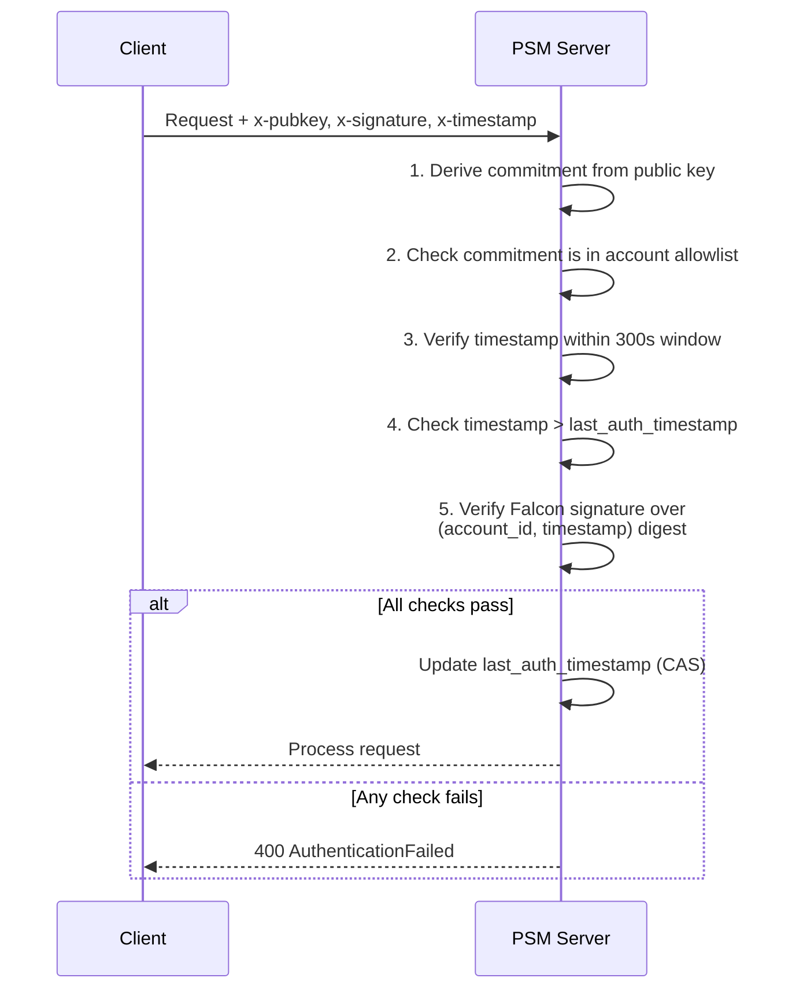

# Components

The PSM server is composed of several pluggable components that handle different responsibilities.

## API

The API exposes a consistent interface for operating on states and deltas over HTTP and gRPC. Behavior is identical across transports, so clients can switch between them without semantic changes.

**HTTP endpoints** (default port 3000):

| Method | Path | Description |
|---|---|---|
| `POST` | `/configure` | Create account with auth policy and initial state |
| `POST` | `/delta` | Push a delta (server validates, signs, sets status) |
| `GET` | `/delta?account_id&nonce` | Fetch delta by nonce |
| `GET` | `/delta/since?account_id&from_nonce` | Merged canonical snapshot since a nonce |
| `GET` | `/state?account_id` | Latest account state |
| `POST` | `/delta/proposal` | Create pending proposal for multi-party signing |
| `GET` | `/delta/proposal?account_id` | List pending proposals |
| `PUT` | `/delta/proposal` | Append cosigner signature to a proposal |
| `GET` | `/pubkey` | Server acknowledgment public key (unauthenticated) |

**gRPC** (default port 50051) mirrors all HTTP endpoints with the same semantics. Credentials are provided via metadata headers.

For the full API specification, see the [spec/api.md](https://github.com/OpenZeppelin/private-state-manager/blob/main/spec/api.md) in the repository.

## Auth

Request authentication is configured per account. All endpoints except `/pubkey` require authentication.

### Falcon RPO

The current authentication policy uses Miden Falcon RPO signatures with an allowlist of **cosigner commitments** — hashes of authorized public keys.

Every authenticated request includes three headers:

| Header | Description |
|---|---|
| `x-pubkey` | Signer's public key (full serialized key or 32-byte commitment hex) |
| `x-signature` | Falcon RPO signature over the request digest |
| `x-timestamp` | Unix timestamp in milliseconds |

The signature is computed over:

```
RPO256_hash([account_id_prefix, account_id_suffix, timestamp_ms, 0])
```

### Verification flow



### Replay protection

PSM prevents replay attacks through two mechanisms:

1. **Timestamp window**: The signed timestamp must be within **300 seconds** (5 minutes) of the server's current time.
2. **Monotonic timestamps**: Each request's timestamp must be strictly greater than the account's `last_auth_timestamp`, enforced atomically via compare-and-swap.

## Acknowledger

The Acknowledger produces tamper-evident acknowledgments for accepted deltas:

- Signs the digest of `new_commitment` and returns the signature as `ack_sig`.
- The server's acknowledgment key is exposed via the `/pubkey` endpoint for clients to cache and verify against.

Clients should verify `ack_sig` after every `push_delta` to confirm the server processed the change correctly.

## Network

The Network component handles interactions with the Miden blockchain:

- Computes commitments and validates deltas against the target network's rules.
- Validates account identifiers and request credentials against network-owned state.
- Merges multiple deltas into a single snapshot payload (for `get_delta_since`).
- Surfaces suggested auth updates (e.g., rotated cosigner commitments) so metadata remains aligned with the network.

## Storage

Storage persists account snapshots, deltas, and delta proposals:

- Provides retrieval by account and nonce, plus range queries for canonicalization.
- Stores pending delta proposals in a per-account namespace keyed by proposal commitment.
- Backends are pluggable without altering API semantics.

Available backends:
- **Filesystem** (default): Stores data on disk. Suitable for **testing and development**. No external dependencies.
- **PostgreSQL** (optional): Recommended for **production** deployments. Requires the `postgres` feature flag at build time. Migrations run automatically on startup.

## Metadata

The Metadata store holds per-account configuration:

- `account_id`, authentication policy, storage backend type, timestamps, and `last_auth_timestamp` for replay protection.
- Supports CRUD operations and list iteration over accounts.
- Can use filesystem or PostgreSQL as its backing store, independent of the Storage backend choice.
