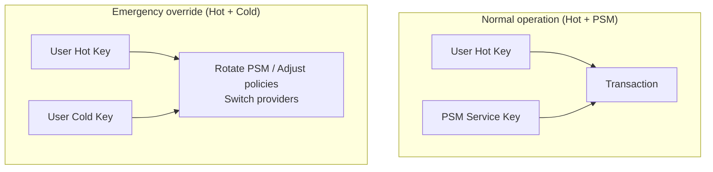

# Edge Cases & Security Considerations

PSM is designed around a clear trust model with well-defined security boundaries.

## Trust model

The right threat model for PSM is **honest-but-curious**: the server is expected to follow the protocol and availability guarantees, but may try to learn as much as it can from any data it is given.

PSM is non-custodial. The provider holds no keys that can unilaterally move funds.

### What PSM can do

- **Store and relay** state snapshots and deltas.
- **Validate** deltas against the Miden network before acknowledging them.
- **Co-sign** transactions as one party in a threshold scheme.
- **Enforce policies** (rate limits, timelocks) at the co-signing layer.

### What PSM cannot do

- **Forge state**: Every delta references the previous commitment. Inserting, reordering, or dropping deltas breaks the commitment chain, detectable by any client.
- **Move funds unilaterally**: PSM holds at most one key in a multi-key setup. It always needs the user's key to complete a transaction.
- **Tamper silently**: The server signs each accepted delta with its acknowledgment key. Clients can verify these signatures to detect any tampering.

### What PSM can do adversarially

- **Deny service**: The server can refuse to serve data or accept deltas. This is a liveness issue, not a safety issue — users can recover using their own keys.
- **Withhold updates**: The server could delay propagating deltas to other devices. Clients should verify state freshness against on-chain commitments.

## Integrity guarantees

### Commitment chain

Every delta includes a `prev_commitment` referencing the base state. This creates an unbroken chain:

- If the server drops a delta, subsequent deltas won't validate because their `prev_commitment` won't match.
- If the server inserts a fake delta, the commitment chain diverges from the on-chain state.
- Clients can verify the chain independently by tracking commitments locally.

### Server acknowledgment

After accepting a delta, the server signs the `new_commitment` with its acknowledgment key. Clients should:

1. Retrieve the server's public key via `/pubkey`.
2. Verify `ack_sig` on every `push_delta` response.
3. Alert on verification failure — it indicates the server may have been compromised or is not processing deltas correctly.

## 2-of-3 key setup

A common PSM configuration uses a **2-of-3** threshold embedded in the account's authentication code:

| Key | Holder | Purpose |
|---|---|---|
| **Key 1** | User hot key | Daily transactions |
| **Key 2** | User cold key | Recovery and emergency override |
| **Key 3** | PSM service key | Co-signing and policy enforcement |

- **Normal operations**: Hot key + PSM's co-signature suffice. PSM verifies the signer is working from the latest state.
- **Emergency override**: Hot + cold keys alone can rotate out PSM, adjust policies, or switch providers.
- **Recovery**: If the PSM provider disappears, the user's hot + cold keys provide full independent control.

## Device recovery

**Without PSM**: A lost device means falling back to a cold backup. Any state changes since the last checkpoint are lost. If an attacker has the device PIN, funds may be at risk.

**With PSM**: The remaining device already has the latest state (synced through PSM). The user initiates a hot key rotation using their cold key. The stolen device's keys become invalid. Recovery takes minutes.

## Edge cases

### State divergence

If two devices submit deltas referencing different base states, PSM rejects the conflicting one (commitment mismatch). The rejected device must resync from PSM before retrying.

### Stale candidates

If a candidate delta's on-chain commitment doesn't match during canonicalization, it is marked `discarded`. Clients are signaled to resync. This is not a rollback of the chain — it prevents clients from drifting onto an invalid local branch.

### Clock skew

Authentication requires timestamps within a 300-second window. Devices with significantly drifting clocks will fail authentication. Ensure NTP synchronization on client devices.

### Provider rotation

Users can switch PSM providers at any time using their hot + cold keys. The new provider is configured with the account's current state and a fresh cosigner allowlist. The old provider's key is rotated out of the account's authentication policy.
