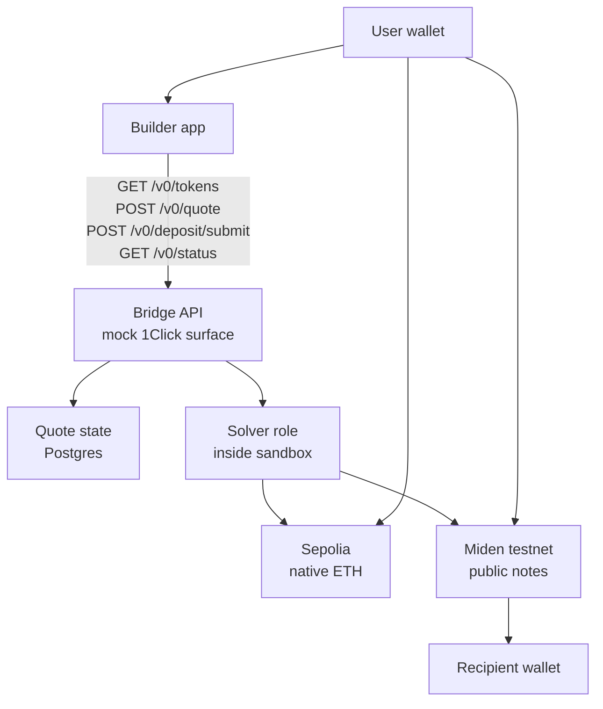
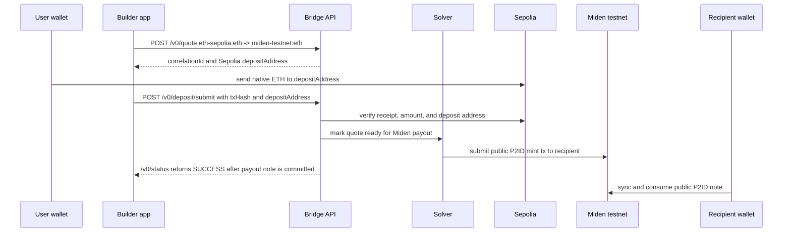
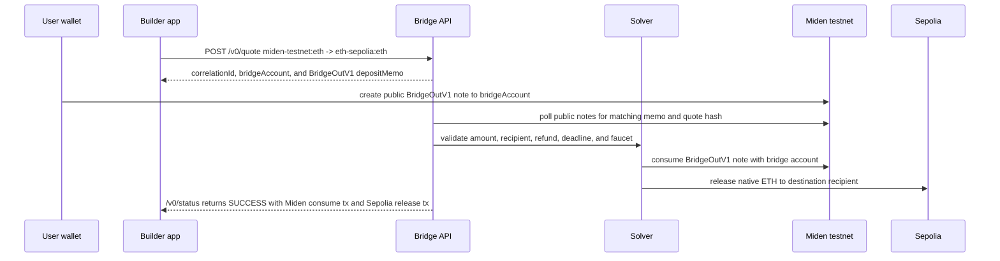

# Bridge flows

The mock bridge sandbox keeps the integration surface small while making the
actors explicit: user wallet, builder app, Bridge API, solver, Sepolia, and
Miden testnet.

The solver role is implemented inside the sandbox service. In production-style
systems, the solver may be a separate operator, but the app-facing flow remains
quote, deposit, status, and settlement evidence.

## Component model

## Inbound: Sepolia to Miden

Inbound means the user starts with Sepolia native ETH and receives a public
Miden payout note.

`SUCCESS` means the bridge-side payout note is committed and consumable. The
recipient still needs to sync and consume the public P2ID note to update local
wallet balance.

## Outbound: Miden to Sepolia

Outbound means the user starts with a Miden testnet asset and receives Sepolia
native ETH.

The outbound deposit is a public programmable Miden note, not a per-quote Miden
account. The note carries the `BridgeOutV1` memo and assets, and the bridge
consumes it only after validating the memo fields against the stored quote.

## Why public notes

Public notes are intentional for the sandbox flow:

- The bridge can observe and validate deposits without requiring per-quote
  Miden account setup.
- A user can target a stable bridge account with a programmable note.
- The note metadata and storage encode the quote hash and settlement
  instructions.
- The same public-note pattern matches Miden's account and note model better
  than EVM-style per-address deposit discovery.

Use private notes only when the bridge or solver has a separate private-note
transport and discovery design. That is outside the current sandbox scope.

## Lifecycle statuses

The sandbox records quote state so restarts can resume in-flight work.

| Status | Meaning |
| --- | --- |
| `PENDING_DEPOSIT` | Quote exists, but the bridge has not verified an origin-chain deposit. |
| `KNOWN_DEPOSIT_TX` | The app submitted an origin-chain transaction hash for verification. |
| `PROCESSING` | Deposit is verified and bridge-side settlement is in progress. |
| `SUCCESS` | Bridge-side settlement is complete. |
| `REFUNDED` | The quote was refunded instead of settled. |
| `FAILED` | The bridge could not complete or refund the quote. |
