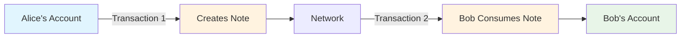

# Transactions & Assets

Welcome to Miden's transaction system! This guide teaches you how Miden transactions work and how to transfer assets using the actor model.

## Miden's Unique Transaction Model

**Transactions** in Miden are fundamentally different from other blockchains. Understanding this difference is key to working effectively with Miden.

### The Actor Model in Action

Miden follows an **actor model** where each account is an independent actor that can:

- Maintain its own state
- Process messages (notes) asynchronously
- Initiate state transitions independently

### Key Transaction Concepts

#### Single-Account Transactions

- **Definition**: Each transaction represents the state transition of exactly one account
- **Implication**: Asset transfers require TWO separate transactions (sender + receiver)
- **Benefit**: Enables parallel processing and privacy

#### Note-Based Communication

- [**Notes**](https://0xmiden.github.io/miden-docs/imported/miden-base/src/note.html) are messages that accounts send to each other
- **Asset transfers** happen via notes containing assets and consumption rules
- **Asynchronous**: Sender and receiver don't need to be online simultaneously

### Transaction vs Transfer



**Traditional Blockchain:**

- 1 transaction = direct balance update (Alice: -100, Bob: +100)

**Miden:**

- Transaction 1 = Alice creates note with 100 tokens
- Transaction 2 = Bob consumes note to receive 100 tokens

## Understanding Faucets in Miden

Before we can send tokens between accounts, we need to understand **faucets** - the source of test tokens in Miden.

### What is a Faucet?

A **faucet** is a specialized type of account in Miden that can mint and distribute tokens. Think of it as a "token factory" that:

- Creates new tokens on demand
- Distributes test tokens to users for experimentation
- Operates under specific rules and limits to prevent abuse

### How Faucets Work

In traditional blockchains, faucets are often external services that send you pre-existing tokens. In Miden:

1. **Faucets are smart contracts** deployed as specialized accounts
2. **Token minting** happens through the faucet's built-in logic
3. **Distribution** occurs via notes (following Miden's actor model)
4. **Each faucet** controls its own token type and distribution rules

### Why Deploy Your Own Faucet?

For development and testing, you'll often want to deploy your own faucet because:

- **Full control** over token supply and distribution rules
- **Custom token metadata** (name, symbol, decimals)
- **Learning experience** with Miden's account deployment

## Getting Started with Transactions

### Prerequisites

- **Account created and deployed** (from [Create Account](./create-account.md))

## Step 1: Deploy a Token Faucet

Before we can transfer tokens, we need a source of test tokens. Let's deploy our own faucet account.

### Deploy the Faucet

Use the `miden client new-account` command to create and deploy a fungible token faucet:

```bash
miden client new-account --account-type fungible-faucet \
                  --component-templates ./basic-fungible-faucet.mct \
                  --deploy
```

You will be promted by the CLI to configure your token metadata. For that, you can use the following default values:

- decimals: `6`
- max_supply: `1000000000000000`
- ticker (symbol): `TST`

:::note todo
Remove the `--deploy` flag for now, as this will result in a client error. Said has been documented in an issue already!
:::

<details>
<summary>Expected output</summary>

```bash
Enter value for 'token_metadata.decimals' - Number of decimal places (type: u8): 6
Enter value for 'token_metadata.max_supply' - Maximum supply of the token in base units (type: felt): 1000000000000000
Enter value for 'token_metadata.ticker' - Token symbol of the faucet's asset, limited to 4 characters. (type: token_symbol): TST
Successfully created new account.
To view account details execute miden client account -s 0xa63cb6b378123aa02925ce5570caab
```

</details>

## Step 2: Mint Tokens From the Faucet

Now that you have a faucet deployed, let's mint some test tokens to your account.

### Understanding Token Minting

In Miden, tokens are distributed through **faucet accounts**, which are specialized accounts that can mint and distribute tokens. When you request tokens from a faucet, you're creating a transaction where the faucet mints tokens directly to your account via a note.

### Request Test Tokens

Use the `miden client mint` command to request tokens from your deployed faucet:

```bash
miden client mint --target <YOUR_ACCOUNT_ID> \
                  --asset 1000::<FAUCET_ACCOUNT_ID> \
                  --note-type private
```

The CLI will prompt you if you want to publish this transaction on-chain. Make sure to type `y` and hit enter.

**What happens in this transaction:**

1. The faucet account receives your mint request
2. Faucet validates the request against its rules (max supply, rate limits, etc.)
3. New tokens are minted and packaged into a note
4. A P2ID note is created targeting your account
5. The note is published to the network for you to consume

<details>
<summary>Expected output</summary>

```bash
Executing transaction...
The transaction will have the following effects:

No notes will be consumed.

1 notes will be created as a result of this transaction.

The account with ID 0xf02fa5328d46c9a0126582d93e1a7c will be modified as follows:
Storage changes:
┌──────────────────────────────────────┬──────────────────────────────────────────────────────────────────────────────────────────────────────┐
│ Storage Slot                         ┆ Effect                                                                                               │
╞══════════════════════════════════════╪══════════════════════════════════════════════════════════════════════════════════════════════════════╡
│ 0                                    ┆ Updated (0x000000000000000000000000000000000000000000000000d007000000000000)                         │
└──────────────────────────────────────┴──────────────────────────────────────────────────────────────────────────────────────────────────────┘
Account Vault will not be changed.
Nonce incremented by: 1.

Continue with proving and submission? Changes will be irreversible once the proof is finalized on the network (y/N)
y
Proving transaction and then submitting it to node...
2025-10-10T14:24:49.138298Z  INFO miden_client::transaction: Proving transaction...
2025-10-10T14:24:49.216530Z  INFO prove_program: miden_prover: Generated execution trace of 80 columns and 131072 steps (48% padded) in 76 ms
2025-10-10T14:24:50.321502Z  INFO miden_client::transaction: Transaction proven.
2025-10-10T14:24:50.321531Z  INFO miden_client::transaction: Submitting transaction to the network...
2025-10-10T14:24:50.611431Z  INFO miden_client::transaction: Transaction submitted.
2025-10-10T14:24:50.611484Z  INFO miden_client::transaction: Applying transaction to the local store...
2025-10-10T14:24:50.643283Z  INFO miden_client::transaction: Transaction stored.
Successfully created transaction.
Transaction ID: 0xf6ad2c1dae634ca695a690b9659490bb024a1c8733c6b2215f82d7904016d2d4
Output notes:
        - 0xe7ef8ddcc261367d1d2cc7e1fcc942bac6b108a1cf9ea823e0b7314f403a6242
```

</details>

### Claim Your Minted Tokens

Asset transfers in Miden involve creating a **note** containing assets and consumption rules. We must then consume this note in a separate transaction to receive and claim the assets.

#### Check for notes to be consumed (new output note)

```bash
miden client notes
```

<details>
<summary>Expected output</summary>

```bash
Input Notes
═══════════════════════════════════════════════════════════════════════════════════════════════════════════════════════════════════════════════
 ...

 Output Notes
═══════════════════════════════════════════════════════════════════════════════════════════════════════════════════════════════════════════════
 0xe7ef8ddcc261367d1d2cc7e1fcc942bac6b108a1cf9ea823e0b7314f403a6242 Expected Full
```

</details>

#### Consume the new output note

```bash
miden client consume-notes <INPUT_NOTE_COMMITMENT>
```

The CLI will prompt you if you want to publish this transaction on-chain to make the changes take effect. Make sure to type `y` and hit enter.

Note: This command lets you specify multiple input notes.

**What happens in this transaction:**

1. Your account locates the minted token note
2. Verification that you're the intended recipient
3. Tokens are transferred from the note to your account vault
4. Your account state updates (balance increases, nonce increments)
5. The note is nullified and cannot be consumed again

<details>
<summary>Expected output</summary>

```bash
Executing transaction...
The transaction will have the following effects:

The following notes will be consumed:
        - 0xe7ef8ddcc261367d1d2cc7e1fcc942bac6b108a1cf9ea823e0b7314f403a6242

No notes will be created as a result of this transaction.

The account with ID 0xdda537f1b413f58004cf3284ba0dfd will be modified as follows:
Account Storage will not be changed.
Vault changes:
┌───────────────────────────────────────────┬─────────────────────────────────────────────────────────────┬───────────────────────────────────┐
│ Asset Type                                ┆ Faucet ID                                                   ┆ Amount                            │
╞═══════════════════════════════════════════╪═════════════════════════════════════════════════════════════╪═══════════════════════════════════╡
│ Fungible Asset                            ┆ 0xf02fa5328d46c9a0126582d93e1a7c                            ┆ +1000                             │
└───────────────────────────────────────────┴─────────────────────────────────────────────────────────────┴───────────────────────────────────┘
Nonce incremented by: 1.

Continue with proving and submission? Changes will be irreversible once the proof is finalized on the network (y/N)
y
Proving transaction and then submitting it to node...
2025-10-10T14:28:55.003771Z  INFO miden_client::transaction: Proving transaction...
2025-10-10T14:28:55.079860Z  INFO prove_program: miden_prover: Generated execution trace of 80 columns and 131072 steps (48% padded) in 74 ms
2025-10-10T14:28:56.123655Z  INFO miden_client::transaction: Transaction proven.
2025-10-10T14:28:56.123684Z  INFO miden_client::transaction: Submitting transaction to the network...
2025-10-10T14:28:56.455312Z  INFO miden_client::transaction: Transaction submitted.
2025-10-10T14:28:56.455448Z  INFO miden_client::transaction: Applying transaction to the local store...
2025-10-10T14:28:56.463206Z  INFO miden_client::transaction: Transaction stored.
Successfully created transaction.
Transaction ID: 0x567e9aa22184b32a7b14d735daed1836677eaebd7c77c2ff4f3c2371b1e3bd8d
The transaction did not generate any output notes.
```

</details>

### Verify Your Balance

Check that the tokens are now in your account:

```bash
miden client account --show <YOUR_ACCOUNT_ID>
```

<details>
<summary>Expected output</summary>

```bash
───────────────────────────────────────────────────────────────────────────────────────────────────────────────────────────────────────────────
 Account Information
═══════════════════════════════════════════════════════════════════════════════════════════════════════════════════════════════════════════════
 Address                                          mtst1qrw62dl3ksfltqqyeuegfwsdl4cqzf5nxgv
───────────────────────────────────────────────────────────────────────────────────────────────────────────────────────────────────────────────
 Account ID (hex)                                 0xdda537f1b413f58004cf3284ba0dfd
───────────────────────────────────────────────────────────────────────────────────────────────────────────────────────────────────────────────
 Account Commitment                               0xc3a7c965965fa2389189063b2d33f705aeec6152b10870f91d3ef6a450a62b54
───────────────────────────────────────────────────────────────────────────────────────────────────────────────────────────────────────────────
 Type                                             Regular
───────────────────────────────────────────────────────────────────────────────────────────────────────────────────────────────────────────────
 Storage mode                                     private
───────────────────────────────────────────────────────────────────────────────────────────────────────────────────────────────────────────────
 Code Commitment                                  0x6a11161925930dae89cc24cbddf0d161cead39b0fe88c262d4e790cff35be01d
───────────────────────────────────────────────────────────────────────────────────────────────────────────────────────────────────────────────
 Vault Root                                       0xd1317e9df05227cb9461e3a0229c572f56e64ec3a08b72025401a6195137c1fe
───────────────────────────────────────────────────────────────────────────────────────────────────────────────────────────────────────────────
 Storage Root                                     0x9c61a1461ac61cd2fbd1e3f90bc4137c60603259a92553edd4603df5367edf0c
───────────────────────────────────────────────────────────────────────────────────────────────────────────────────────────────────────────────
 Nonce                                            1
───────────────────────────────────────────────────────────────────────────────────────────────────────────────────────────────────────────────

Assets:
┌───────────────────────────────────────────┬─────────────────────────────────────────────────────────────┬───────────────────────────────────┐
│ Asset Type                                ┆ Faucet                                                      ┆ Amount                            │
╞═══════════════════════════════════════════╪═════════════════════════════════════════════════════════════╪═══════════════════════════════════╡
│ Fungible Asset                            ┆ 0xf02fa5328d46c9a0126582d93e1a7c                            ┆ 1000                              │
└───────────────────────────────────────────┴─────────────────────────────────────────────────────────────┴───────────────────────────────────┘

...

```

</details>

## Step 3: Send Tokens to Another Account

Now that you have tokens, let's send some to another account.

### Create a Transfer Note

Send assets to another account by creating a note:

```bash
# Send 100 TST tokens to another account
miden client send --target <RECIPIENT_ACCOUNT_ID> \
                  --asset 100::<FAUCET_ACCOUNT_ID> \
                  --note-type private
```

**What happens in this transaction:**

1. Your account's authentication verifies the request
2. 100 TST tokens are moved from your vault to a note
3. A [P2ID (Pay-to-ID) note](https://0xmiden.github.io/miden-docs/imported/miden-base/src/note.html#p2id-pay-to-id) is created with consumption rules (only target ID can consume it)
4. Your account state updates (balance decreases, nonce increments)

<details>
<summary>Expected output</summary>

```bash
Executing transaction...
The transaction will have the following effects:

No notes will be consumed.

1 notes will be created as a result of this transaction.

The account with ID 0xdda537f1b413f58004cf3284ba0dfd will be modified as follows:
Account Storage will not be changed.
Vault changes:
┌───────────────────────────────────────────┬─────────────────────────────────────────────────────────────┬───────────────────────────────────┐
│ Asset Type                                ┆ Faucet ID                                                   ┆ Amount                            │
╞═══════════════════════════════════════════╪═════════════════════════════════════════════════════════════╪═══════════════════════════════════╡
│ Fungible Asset                            ┆ 0xf02fa5328d46c9a0126582d93e1a7c                            ┆ -100                              │
└───────────────────────────────────────────┴─────────────────────────────────────────────────────────────┴───────────────────────────────────┘
Nonce incremented by: 1.

Continue with proving and submission? Changes will be irreversible once the proof is finalized on the network (y/N)
y
Proving transaction and then submitting it to node...
2025-10-10T14:35:29.378102Z  INFO miden_client::transaction: Proving transaction...
2025-10-10T14:35:29.460068Z  INFO prove_program: miden_prover: Generated execution trace of 80 columns and 131072 steps (49% padded) in 79 ms
2025-10-10T14:35:30.460343Z  INFO miden_client::transaction: Transaction proven.
2025-10-10T14:35:30.460375Z  INFO miden_client::transaction: Submitting transaction to the network...
2025-10-10T14:35:31.857637Z  INFO miden_client::transaction: Transaction submitted.
2025-10-10T14:35:31.857737Z  INFO miden_client::transaction: Applying transaction to the local store...
2025-10-10T14:35:31.989036Z  INFO miden_client::transaction: Transaction stored.
Successfully created transaction.
Transaction ID: 0x5bd8e099dffb56e5f409d66240be2f30ec4b0afed1ff05f08cec2ba5207d3224
Output notes:
        - 0xb186a2dd9070330ca299327503d59cd88f66042caa7dbfdd152e046f9cff15dd
```

</details>

### Verify Your Updated Balance

Check that assets left your account:

```bash
miden client account --show <YOUR_ACCOUNT_ID>
```

<details>
<summary>Expected output</summary>

```bash
───────────────────────────────────────────────────────────────────────────────────────────────────────────────────────────────────────────────
 Account Information
═══════════════════════════════════════════════════════════════════════════════════════════════════════════════════════════════════════════════
 Address                                          mtst1qrw62dl3ksfltqqyeuegfwsdl4cqzf5nxgv
───────────────────────────────────────────────────────────────────────────────────────────────────────────────────────────────────────────────
 Account ID (hex)                                 0xdda537f1b413f58004cf3284ba0dfd
───────────────────────────────────────────────────────────────────────────────────────────────────────────────────────────────────────────────
 Account Commitment                               0xa08465280343644e4305bf626a9fd64559504c922ff38d23c639a4927080a1d2
───────────────────────────────────────────────────────────────────────────────────────────────────────────────────────────────────────────────
 Type                                             Regular
───────────────────────────────────────────────────────────────────────────────────────────────────────────────────────────────────────────────
 Storage mode                                     private
───────────────────────────────────────────────────────────────────────────────────────────────────────────────────────────────────────────────
 Code Commitment                                  0x6a11161925930dae89cc24cbddf0d161cead39b0fe88c262d4e790cff35be01d
───────────────────────────────────────────────────────────────────────────────────────────────────────────────────────────────────────────────
 Vault Root                                       0x2581e5963d62d780428ebe783f07b64dcdeaa30d241bb006ec8deda081e903ed
───────────────────────────────────────────────────────────────────────────────────────────────────────────────────────────────────────────────
 Storage Root                                     0x9c61a1461ac61cd2fbd1e3f90bc4137c60603259a92553edd4603df5367edf0c
───────────────────────────────────────────────────────────────────────────────────────────────────────────────────────────────────────────────
 Nonce                                            2
───────────────────────────────────────────────────────────────────────────────────────────────────────────────────────────────────────────────

Assets:
┌───────────────────────────────────────────┬─────────────────────────────────────────────────────────────┬───────────────────────────────────┐
│ Asset Type                                ┆ Faucet                                                      ┆ Amount                            │
╞═══════════════════════════════════════════╪═════════════════════════════════════════════════════════════╪═══════════════════════════════════╡
│ Fungible Asset                            ┆ 0xf02fa5328d46c9a0126582d93e1a7c                            ┆ 900                               │
└───────────────────────────────────────────┴─────────────────────────────────────────────────────────────┴───────────────────────────────────┘

```

</details>

## Step 4: Receiving Tokens (As a Recipient)

If someone sent you tokens, here's how to receive them:

### Discover Available Notes

Check for notes sent to your account:

```bash
miden client notes
```

<details>
<summary>Expected output</summary>

```bash
Input Notes
═══════════════════════════════════════════════════════════════════════════════════════════════════════════════════════════════════════════════
 ...

 Output Notes
═══════════════════════════════════════════════════════════════════════════════════════════════════════════════════════════════════════════════
 0xb186a2dd9070330ca299327503d59cd88f66042caa7dbfdd152e046f9cff15dd Expected Full
```

</details>

### Consume the Note

Create a transaction to claim the assets:

```bash
miden client consume-notes <NOTE_COMMITMENT>
```

**What happens in this transaction:**

1. Your account locates the note
2. Verification that you're the intended recipient
3. Assets are added to your account vault
4. Account state updates (balance increases, nonce increments)
5. Note is nullified (can't be consumed again)

<details>
<summary>Expected output</summary>

```bash
Executing transaction...
The transaction will have the following effects:

The following notes will be consumed:
        - 0xb186a2dd9070330ca299327503d59cd88f66042caa7dbfdd152e046f9cff15dd

No notes will be created as a result of this transaction.

The account with ID 0xfafb994b99e237806c9b9c7aa8f430 will be modified as follows:
Account Storage will not be changed.
Vault changes:
┌───────────────────────────────────────────┬─────────────────────────────────────────────────────────────┬───────────────────────────────────┐
│ Asset Type                                ┆ Faucet ID                                                   ┆ Amount                            │
╞═══════════════════════════════════════════╪═════════════════════════════════════════════════════════════╪═══════════════════════════════════╡
│ Fungible Asset                            ┆ 0xf02fa5328d46c9a0126582d93e1a7c                            ┆ +100                              │
└───────────────────────────────────────────┴─────────────────────────────────────────────────────────────┴───────────────────────────────────┘
Nonce incremented by: 1.

Continue with proving and submission? Changes will be irreversible once the proof is finalized on the network (y/N)
y
Proving transaction and then submitting it to node...
2025-10-10T14:37:36.985416Z  INFO miden_client::transaction: Proving transaction...
2025-10-10T14:37:37.059034Z  INFO prove_program: miden_prover: Generated execution trace of 80 columns and 131072 steps (48% padded) in 72 ms
2025-10-10T14:37:38.188713Z  INFO miden_client::transaction: Transaction proven.
2025-10-10T14:37:38.188738Z  INFO miden_client::transaction: Submitting transaction to the network...
2025-10-10T14:37:38.434408Z  INFO miden_client::transaction: Transaction submitted.
2025-10-10T14:37:38.434497Z  INFO miden_client::transaction: Applying transaction to the local store...
2025-10-10T14:37:38.438447Z  INFO miden_client::transaction: Transaction stored.
Successfully created transaction.
Transaction ID: 0x9693b7ea267883c531723ca4ef23f3452e3a0d19face30646e73e1049c601b33
The transaction did not generate any output notes.
```

</details>

## Advanced Transaction Types

### Time-Locked Transfers (P2IDE)

:::info TODO
Refactor this so that it uses timelock-height and also recall-height. Amend the descriptions too so that everything is correct.
:::

Create transfers with a timelock:

```bash
miden client send --target <RECIPIENT> \
                  --asset 100::TST \
                  --timelock-height <TIMELOCK_BLOCK_HEIGHT> \
                  --note-type private
```

**How it works:**

- Recipient must wait until timelock height (block number) has passed to consume the note
- Useful for conditional payments or escrow scenarios

### Recallable Transfers (P2IDE)

Create recallable transfers:

```bash
miden client send --target <RECIPIENT> \
                  --asset 100::<FAUCET_ACCOUNT_ID> \
                  --recall-height <RECALL_BLOCK_HEIGHT> \
                  --note-type private
```

**How it works:**

- Recipient can consume the note at any time
- Sender can recall (consume) the note if the recall height (block number) has passed

### Atomic Swaps (SWAP Notes)

Exchange assets directly between accounts:

```bash
miden client swap --offered-asset <AMOUNT>::<ASSET_ID> \
                  --requested-asset <AMOUNT>::<ASSET_ID> \
                  --note-type private \
                  --payback-note-type <PAYBACK_NOTE_TYPE>
```

**How it works:**

- Creates a note with swap conditions
- Counterparty can fulfill the swap or ignore it
- Assets are exchanged atomically or not at all

## Why This Model Matters

### Benefits of Actor-Based Transactions

1. **Parallel Processing**: Multiple accounts can process transactions simultaneously
2. **Enhanced Privacy**: Sender and receiver operations are separate
3. **Scalability**: No global state synchronization required
4. **Security**: Each account controls its own state transitions
5. **Flexibility**: Complex transaction logic can be embedded in notes

### Real-World Analogy

Think of Miden transactions like **sending mail**:

- **Sender**: Creates a letter (note) and puts it in the mailbox (network)
- **Recipient**: Checks mailbox and retrieves the letter when convenient
- **Asynchronous**: Both parties don't need to be present simultaneously
- **Private**: Only the intended recipient can open the letter
