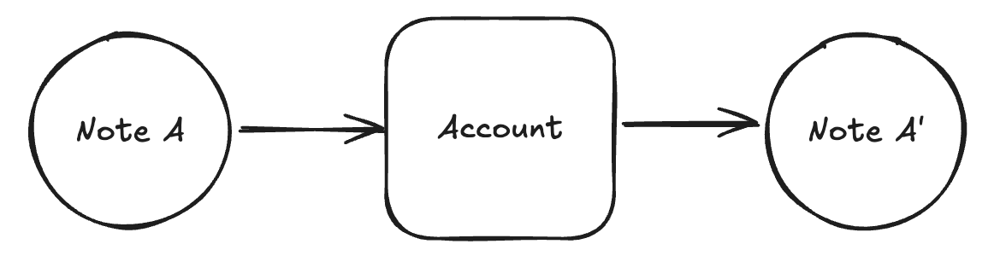

# Creating Notes in Miden Assembly

_Creating notes inside the MidenVM using Miden assembly_

## Overview

In this tutorial, we will create a custom note that generates a copy of itself when it is consumed by an account. The purpose of this tutorial is to demonstrate how to create notes inside the MidenVM using Miden assembly (MASM). By the end of this tutorial, you will understand how to write MASM code that creates notes.

## What We'll Cover

- Computing the note inputs commitment in MASM
- Creating notes in MASM

## Prerequisites

This tutorial assumes you have a basic understanding of Miden assembly and that you have completed the tutorial on [creating a custom note](./custom_note_how_to.md).

## Why Creating Notes in MASM Is Useful

Being able to create a note in MASM enables you to build various types of applications. Creating a note during the consumption of another note or from an account allows you to develop complex DeFi applications.

Here are some tangible examples of when creating a note in MASM is useful in a DeFi context:

- Creating snapshots of an account's state at a specific point in time (not possible in an EVM context)
- Representing partially fillable buy/sell orders as notes (SWAPP)
- Handling withdrawals from a smart contract

## What We Will Be Building



In the diagram above, note A is consumed by an account, and during the transaction, note A' is created.

In this tutorial, we will create a note that contains an asset. When consumed, it outputs a copy of itself and allows the consuming account to take half of the asset. Although this type of note would not be used in a real-world context, it demonstrates several key concepts for writing MASM code that can create notes.

## Step 1: Initialize Your Repository

Create a new Rust repository for your Miden project and navigate to it with the following command:

```bash
cargo new miden-project
cd miden-project
```

Add the following dependencies to your `Cargo.toml` file:

```toml
[dependencies]
miden-client = { version = "0.14", features = ["testing", "tonic"] }
miden-client-sqlite-store = { version = "0.14", package = "miden-client-sqlite-store" }
miden-protocol = { version = "0.14" }
rand = { version = "0.9" }
serde = { version = "1", features = ["derive"] }
serde_json = { version = "1.0", features = ["raw_value"] }
tokio = { version = "1.46", features = ["rt-multi-thread", "net", "macros", "fs"] }
rand_chacha = "0.9.0"
```

## Step 2: Write the Note Script

For better code organization, we will separate the Miden assembly code from our Rust code.

Create a directory named `masm` at the **root** of your `miden-project` directory. This directory will contain our contract and MASM script code.

Initialize the `masm` directory:

```bash
mkdir masm/notes
```

This will create:

```text
masm/
└── notes/
```

Inside the `masm/notes/` directory, create the file `iterative_output_note.masm`:

```masm
use miden::protocol::active_note
use miden::protocol::note
use miden::protocol::output_note
use miden::core::sys
use miden::standards::wallets::basic->wallet

# Memory Addresses
# get_assets writes: ASSET_KEY at ASSET_KEY_PTR, ASSET_VALUE at ASSET_KEY_PTR+4 (ASSET_SIZE=8)
const ASSET_KEY_PTR=0
const ASSET_VALUE_PTR=4
const ASSET_HALF_VALUE_PTR=8    # half-amount ASSET_VALUE stored here
const ACCOUNT_ID_PREFIX=12      # storage: [prefix, suffix, tag, 0]
const TAG=14                    # = ACCOUNT_ID_PREFIX + 2

# => []
begin
    # Drop word if user accidentally pushes note_args
    dropw
    # => []

    # Get asset contained in note into memory (ASSET_KEY at 0, ASSET_VALUE at 4)
    push.ASSET_KEY_PTR exec.active_note::get_assets drop drop
    # => []

    # Load ASSET_VALUE and compute half amount
    padw push.ASSET_VALUE_PTR mem_loadw_le
    # => [av0, av1, av2, av3]  (av0 = amount for fungible asset, av1/av2/av3 = 0)

    # Halve the amount (av0 is amount for fungible assets in v0.14)
    push.2 div
    # => [av0/2, av1, av2, av3]

    # Store as ASSET_HALF_VALUE
    mem_storew_le.ASSET_HALF_VALUE_PTR dropw
    # => []

    # Receive all assets from note into the account wallet
    exec.wallet::add_assets_to_account
    # => []

    # Push script hash
    exec.active_note::get_script_root
    # => [SCRIPT_HASH]

    # Get the current note serial number
    exec.active_note::get_serial_number
    # => [SERIAL_NUM, SCRIPT_HASH]

    # Increment the last element of the serial number by 1
    # (serial_num[3] is at depth 3; matches Rust: serial_num[3] + 1)
    swap.3 push.1 add swap.3
    # => [SERIAL_NUM+1, SCRIPT_HASH]

    # Load note storage into memory for recipient construction
    push.ACCOUNT_ID_PREFIX
    exec.active_note::get_storage
    # => [num_storage_items, dest_ptr, SERIAL_NUM+1, SCRIPT_HASH]

    swap
    # => [dest_ptr, num_storage_items, SERIAL_NUM+1, SCRIPT_HASH]

    exec.note::build_recipient
    # => [RECIPIENT]

    # Push note type to stack (public note = 1)
    push.1
    # => [note_type, RECIPIENT]

    # Load tag from memory
    mem_load.TAG
    # => [tag, note_type, RECIPIENT]

    exec.output_note::create
    # => [note_idx]

    # Build [ASSET_KEY, ASSET_HALF_VALUE, note_idx] for move_asset_to_note
    # Inputs: [ASSET_KEY, ASSET_VALUE, note_idx, pad(7)]

    # Push ASSET_HALF_VALUE (note_idx moves to depth 4)
    padw push.ASSET_HALF_VALUE_PTR mem_loadw_le
    # => [ASSET_HALF_VALUE, note_idx]

    # Push ASSET_KEY (ASSET_HALF_VALUE moves to depth 4, note_idx to depth 8)
    padw push.ASSET_KEY_PTR mem_loadw_le
    # => [ASSET_KEY, ASSET_HALF_VALUE, note_idx]

    call.wallet::move_asset_to_note
    # => [pad(16)]

    dropw dropw dropw dropw
    # => []

    exec.sys::truncate_stack
    # => []
end
```

### How the Assembly Code Works:

1. **Retrieving the asset:**  
   The note calls `active_note::get_assets` to write the asset into memory, with `ASSET_KEY` at address 0 and `ASSET_VALUE` at address 4. It halves the amount in `ASSET_VALUE` and stores it at `ASSET_HALF_VALUE_PTR`. Finally, it calls `wallet::add_assets_to_account` to receive all note assets into the consuming account.
2. **Getting the script hash and serial number:**  
   The note script calls `active_note::get_script_root` to fetch the script hash and `active_note::get_serial_number` to fetch the current serial number, then increments element 3 (the last element) by 1 to avoid duplicate recipients.
3. **Building the `RECIPIENT`:**  
   The script loads the note storage into memory with `active_note::get_storage`, then calls `note::build_recipient`. This computes the storage commitment and stores the preimage in the advice map, which is required for public notes.
4. **Creating the note:**  
   To create the note, the script pushes the note type and tag onto the stack, then calls the `output_note::create` procedure, which returns the note index.
5. **Moving assets to the note:**  
   After the note is created, the script loads `ASSET_KEY` and `ASSET_HALF_VALUE` from memory onto the stack and calls `wallet::move_asset_to_note` with the note index.
6. **Stack cleanup:**  
   Finally, the script cleans up the stack by calling `sys::truncate_stack`.

## Step 3: Rust Program

With the Miden assembly note script written, we can move on to writing the Rust script to create and consume the note.

Copy and paste the following code into your `src/main.rs` file.

```rust no_run
use miden_client::auth::{AuthSchemeId, AuthSingleSig};
use rand::RngCore;
use std::{fs, path::Path, sync::Arc};
use tokio::time::{sleep, Duration};

use miden_client::{
    account::{
        component::{AuthControlled, BasicFungibleFaucet, BasicWallet},
        Account,
    },
    address::NetworkId,
    asset::{FungibleAsset, TokenSymbol},
    auth::AuthSecretKey,
    builder::ClientBuilder,
    crypto::FeltRng,
    keystore::{FilesystemKeyStore, Keystore},
    note::{
        Note, NoteAssets, NoteMetadata, NoteRecipient, NoteStorage, NoteTag, NoteType,
    },
    rpc::{Endpoint, GrpcClient},
    transaction::TransactionRequestBuilder,
    Client, ClientError, Felt,
};
use miden_client_sqlite_store::ClientBuilderSqliteExt;
use miden_client::{
    account::{AccountBuilder, AccountStorageMode, AccountType},
    note::NoteDetails,
};

// Helper to create a basic account
async fn create_basic_account(
    client: &mut Client<FilesystemKeyStore>,
    keystore: &Arc<FilesystemKeyStore>,
) -> Result<Account, ClientError> {
    let mut init_seed = [0u8; 32];
    client.rng().fill_bytes(&mut init_seed);

    let key_pair = AuthSecretKey::new_falcon512_poseidon2_with_rng(client.rng());

    let account = AccountBuilder::new(init_seed)
        .account_type(AccountType::RegularAccountUpdatableCode)
        .storage_mode(AccountStorageMode::Public)
        .with_auth_component(AuthSingleSig::new(key_pair.public_key().to_commitment(), AuthSchemeId::Falcon512Poseidon2))
        .with_component(BasicWallet)
        .build()
        .unwrap();

    client.add_account(&account, false).await?;
    keystore.add_key(&key_pair, account.id()).await.unwrap();

    Ok(account)
}

async fn create_basic_faucet(
    client: &mut Client<FilesystemKeyStore>,
    keystore: &Arc<FilesystemKeyStore>,
) -> Result<Account, ClientError> {
    let mut init_seed = [0u8; 32];
    client.rng().fill_bytes(&mut init_seed);

    let key_pair = AuthSecretKey::new_falcon512_poseidon2_with_rng(client.rng());
    let symbol = TokenSymbol::new("MID").unwrap();
    let decimals = 8;
    let max_supply = Felt::new(1_000_000);

    let account = AccountBuilder::new(init_seed)
        .account_type(AccountType::FungibleFaucet)
        .storage_mode(AccountStorageMode::Public)
        .with_auth_component(AuthSingleSig::new(key_pair.public_key().to_commitment(), AuthSchemeId::Falcon512Poseidon2))
        .with_component(BasicFungibleFaucet::new(symbol, decimals, max_supply).unwrap())
        .with_component(AuthControlled::allow_all())
        .build()
        .unwrap();

    client.add_account(&account, false).await?;
    keystore.add_key(&key_pair, account.id()).await.unwrap();

    Ok(account)
}

// Helper to wait until an account has the expected number of consumable notes
async fn wait_for_notes(
    client: &mut Client<FilesystemKeyStore>,
    account_id: &Account,
    expected: usize,
) -> Result<(), ClientError> {
    loop {
        client.sync_state().await?;
        let notes = client.get_consumable_notes(Some(account_id.id())).await?;
        if notes.len() >= expected {
            break;
        }
        println!(
            "{} consumable notes found for account {}. Waiting...",
            notes.len(),
            account_id.id().to_bech32(NetworkId::Testnet)
        );
        sleep(Duration::from_secs(3)).await;
    }
    Ok(())
}

#[tokio::main]
async fn main() -> Result<(), ClientError> {
    // Initialize client
    let endpoint = Endpoint::testnet();
    let timeout_ms = 10_000;
    let rpc_client = Arc::new(GrpcClient::new(&endpoint, timeout_ms));

    // Initialize keystore
    let keystore_path = std::path::PathBuf::from("./keystore");
    let keystore = Arc::new(FilesystemKeyStore::new(keystore_path).unwrap());

    let store_path = std::path::PathBuf::from("./store.sqlite3");

    let mut client = ClientBuilder::new()
        .rpc(rpc_client)
        .sqlite_store(store_path)
        .authenticator(keystore.clone())
        .in_debug_mode(true.into())
        .build()
        .await?;

    let sync_summary = client.sync_state().await.unwrap();
    println!("Latest block: {}", sync_summary.block_num);

    // -------------------------------------------------------------------------
    // STEP 1: Create accounts and deploy faucet
    // -------------------------------------------------------------------------
    println!("\n[STEP 1] Creating new accounts");
    let alice_account = create_basic_account(&mut client, &keystore).await?;
    println!(
        "Alice's account ID: {:?}",
        alice_account.id().to_bech32(NetworkId::Testnet)
    );
    let bob_account = create_basic_account(&mut client, &keystore).await?;
    println!(
        "Bob's account ID: {:?}",
        bob_account.id().to_bech32(NetworkId::Testnet)
    );

    println!("\nDeploying a new fungible faucet.");
    let faucet = create_basic_faucet(&mut client, &keystore).await?;
    println!(
        "Faucet account ID: {:?}",
        faucet.id().to_bech32(NetworkId::Testnet)
    );
    client.sync_state().await?;

    // -------------------------------------------------------------------------
    // STEP 2: Mint tokens with P2ID
    // -------------------------------------------------------------------------
    println!("\n[STEP 2] Mint tokens with P2ID");
    let faucet_id = faucet.id();
    let amount: u64 = 100;
    let mint_amount = FungibleAsset::new(faucet_id, amount).unwrap();

    let tx_req = TransactionRequestBuilder::new()
        .build_mint_fungible_asset(
            mint_amount,
            alice_account.id(),
            NoteType::Public,
            client.rng(),
        )
        .unwrap();

    let tx_id = client.submit_new_transaction(faucet.id(), tx_req).await?;
    println!("Minted tokens. TX: {:?}", tx_id);

    wait_for_notes(&mut client, &alice_account, 1).await?;

    // Consume the minted note
    let consumable_notes = client
        .get_consumable_notes(Some(alice_account.id()))
        .await?;

    if let Some((note_record, _)) = consumable_notes.first() {
        let note: Note = note_record.clone().try_into()?;
        let consume_req = TransactionRequestBuilder::new().build_consume_notes(vec![note])?;

        let tx_id = client
            .submit_new_transaction(alice_account.id(), consume_req)
            .await?;
        println!("Consumed minted note. TX: {:?}", tx_id);
    }

    client.sync_state().await?;

    // -------------------------------------------------------------------------
    // STEP 3: Create iterative output note
    // -------------------------------------------------------------------------
    println!("\n[STEP 3] Create iterative output note");

    let code = fs::read_to_string(Path::new("../masm/notes/iterative_output_note.masm")).unwrap();
    let serial_num = client.rng().draw_word();

    // Create note metadata and tag
    let tag = NoteTag::new(0);
    let metadata = NoteMetadata::new(alice_account.id(), NoteType::Public).with_tag(tag);
    let note_script = client.code_builder().compile_note_script(&code).unwrap();
    let note_storage = NoteStorage::new(vec![
        alice_account.id().prefix().as_felt(),
        alice_account.id().suffix(),
        tag.into(),
        Felt::new(0),
    ])
    .unwrap();

    let recipient = NoteRecipient::new(serial_num, note_script.clone(), note_storage.clone());
    let vault = NoteAssets::new(vec![mint_amount.into()])?;
    let custom_note = Note::new(vault, metadata, recipient);

    let note_req = TransactionRequestBuilder::new()
        .own_output_notes(vec![custom_note.clone()])
        .build()
        .unwrap();

    let tx_id = client
        .submit_new_transaction(alice_account.id(), note_req)
        .await?;
    println!(
        "View transaction on MidenScan: https://testnet.midenscan.com/tx/{:?}",
        tx_id
    );

    client.sync_state().await?;

    // -------------------------------------------------------------------------
    // STEP 4: Consume the iterative output note
    // -------------------------------------------------------------------------
    println!("\n[STEP 4] Bob consumes the note and creates a copy");

    // Increment the serial number for the new note
    let serial_num_1 = [
        serial_num[0],
        serial_num[1],
        serial_num[2],
        Felt::new(serial_num[3].as_canonical_u64() + 1),
    ]
    .into();

    // Reuse the note_script and note_storage
    let recipient = NoteRecipient::new(serial_num_1, note_script, note_storage);

    // Note: Change metadata to include Bob's account as the creator
    let metadata = NoteMetadata::new(bob_account.id(), NoteType::Public).with_tag(tag);

    let asset_amount_1 = FungibleAsset::new(faucet_id, 50).unwrap();
    let vault = NoteAssets::new(vec![asset_amount_1.into()])?;
    let output_note = Note::new(vault, metadata, recipient);

    let consume_custom_req = TransactionRequestBuilder::new()
        .input_notes([(custom_note, None)])
        .expected_future_notes(vec![(
            NoteDetails::from(output_note.clone()),
            output_note.metadata().tag(),
        )
            .clone()])
        .expected_output_recipients(vec![output_note.recipient().clone()])
        .build()
        .unwrap();

    let tx_id = client
        .submit_new_transaction(bob_account.id(), consume_custom_req)
        .await?;
    println!(
        "Consumed Note Tx on MidenScan: https://testnet.midenscan.com/tx/{:?}",
        tx_id
    );

    Ok(())
}
```

Run the following command to execute `src/main.rs`:

```bash
cargo run --release
```

The output will look something like this:

```text
Latest block: 4186

[STEP 1] Creating new accounts
Alice's account ID: "mtst1aqnztxg76d5exyr7ja05pzhvegx3jc84"
Bob's account ID: "mtst1az0mfyzm3xqe2yrezucvmc24dv5gset0"

Deploying a new fungible faucet.
Faucet account ID: "mtst1ary7kplxvatxkgpes4llcc53yu8px433"

[STEP 2] Mint tokens with P2ID
Minted tokens. TX: 0x8577213057226b7d0545d73f6e1bc416354a324089450cb859f5784c133d4cc0
0 consumable notes found for account mtst1aqnztxg76d5exyr7ja05pzhvegx3jc84. Waiting...
Consumed minted note. TX: 0xd93e791d3283192df121de4cf938a4f9cfaed48f4e593e1b82d147e2d642b7bd

[STEP 3] Create iterative output note
View transaction on MidenScan: https://testnet.midenscan.com/tx/0xcd71a1d87c60ab7632a7836723fff4014b02992ef7ea5d3fe2030a971e795a8a

[STEP 4] Bob consumes the note and creates a copy
Consumed Note Tx on MidenScan: https://testnet.midenscan.com/tx/0x4d91519c180874c931480fa58620f864fd7c7aada35ada2d40082291298084bb
Account delta: AccountVaultDelta { fungible: FungibleAssetDelta({V0(Accoun
```

---

### Running the example

To run the full example, navigate to the `rust-client` directory in the [miden-tutorials](https://github.com/0xMiden/miden-tutorials/) repository and run this command:

```bash
cd rust-client
cargo run --release --bin note_creation_in_masm
```

### Continue learning

Next tutorial: [Delegated Proving](./delegated_proving_tutorial.md)
