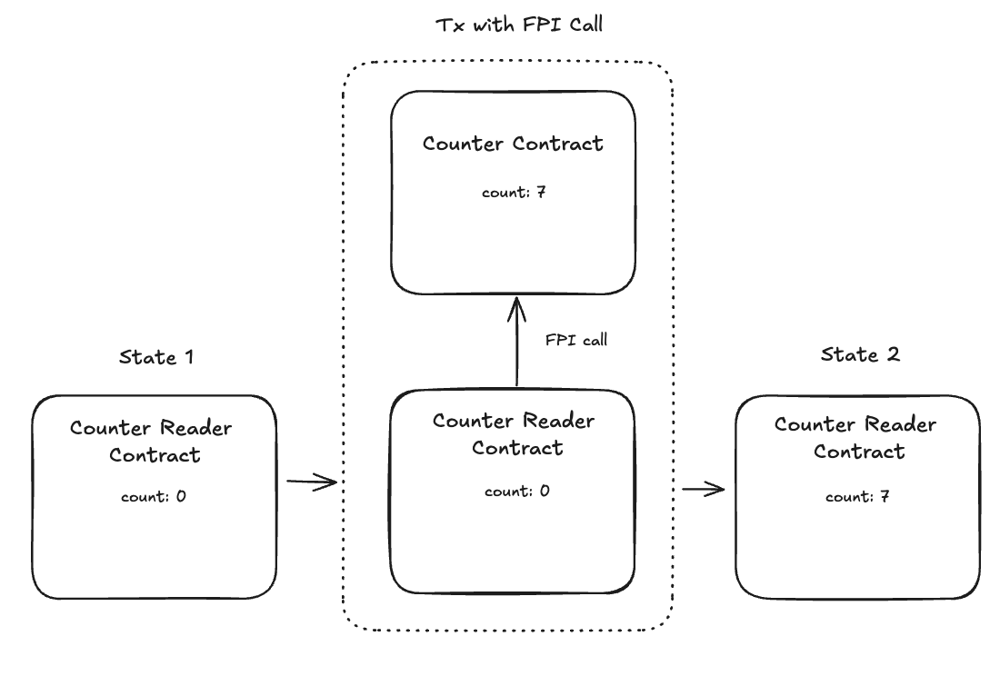

# Foreign Procedure Invocation Tutorial

_Using foreign procedure invocation to craft read-only cross-contract calls with the Miden client_

## Overview

In the previous tutorial we deployed a fresh counter smart contract and incremented its count with a transaction script.

In this tutorial we will cover the basics of "foreign procedure invocation" (FPI) using the Miden client. This tutorial is self-contained: it deploys its own counter contract from scratch, then builds a "count copy" smart contract, and uses FPI to read the count from the counter contract and copy it to the count reader's local storage.

Foreign procedure invocation (FPI) is a powerful tool for building composable smart contracts in Miden. FPI allows one smart contract or note to read the state of another contract.

The term "foreign procedure invocation" might sound a bit verbose, but it is as simple as one smart contract calling a non-state modifying procedure in another smart contract. The "EVM equivalent" of foreign procedure invocation would be a smart contract calling a read-only function in another contract.

FPI is useful for developing smart contracts that extend the functionality of existing contracts on Miden. FPI is the core primitive used by price oracles on Miden.

## What We Will Build



The diagram above depicts the "count copy" smart contract using foreign procedure invocation to read the count state of the counter contract. After reading the state via FPI, the "count copy" smart contract writes the value returned from the counter contract to storage.

## What we'll cover

- Foreign Procedure Invocation (FPI) with the Miden client
- Building a "count copy" smart contract
- Executing cross-contract calls in the browser

## Prerequisites

- Node `v20` or greater
- Familiarity with TypeScript
- `yarn`

This tutorial assumes you have a basic understanding of Miden assembly and completed the previous tutorial on incrementing the counter contract. To quickly get up to speed with Miden assembly (MASM), please play around with running basic Miden assembly programs in the [Miden playground](https://0xmiden.github.io/examples/).

## Step 1: Initialize your Next.js project

1. Create a new Next.js app with TypeScript:

   ```bash
   yarn create next-app@latest miden-fpi-app --typescript
   ```

   Hit enter for all terminal prompts.

2. Change into the project directory:

   ```bash
   cd miden-fpi-app
   ```

3. Install the Miden SDK:
   ```bash
   yarn add @miden-sdk/miden-sdk@0.14.4
   ```

**NOTE!**: Be sure to add the `--webpack` command to your `package.json` when running the `dev script`. The dev script should look like this:

`package.json`

```json
  "scripts": {
    "dev": "next dev --webpack",
    ...
  }
```

## Step 2: Edit the `app/page.tsx` file

Add the following code to the `app/page.tsx` file. This code defines the main page of our web application:

```tsx
'use client';
import { useState } from 'react';
import { foreignProcedureInvocation } from '../lib/foreignProcedureInvocation';

export default function Home() {
  const [isFPIRunning, setIsFPIRunning] = useState(false);

  const handleForeignProcedureInvocation = async () => {
    setIsFPIRunning(true);
    await foreignProcedureInvocation();
    setIsFPIRunning(false);
  };

  return (
    <main className="min-h-screen flex items-center justify-center bg-gradient-to-br from-gray-900 via-gray-800 to-black text-slate-800 dark:text-slate-100">
      <div className="text-center">
        <h1 className="text-4xl font-semibold mb-4">Miden FPI Web App</h1>
        <p className="mb-6">
          Open your browser console to see Miden client logs.
        </p>

        <div className="max-w-sm w-full bg-gray-800/20 border border-gray-600 rounded-2xl p-6 mx-auto flex flex-col gap-4">
          <button
            onClick={handleForeignProcedureInvocation}
            className="w-full px-6 py-3 text-lg cursor-pointer bg-transparent border-2 border-orange-600 text-white rounded-lg transition-all hover:bg-orange-600 hover:text-white"
          >
            {isFPIRunning
              ? 'Working...'
              : 'Foreign Procedure Invocation Tutorial'}
          </button>
        </div>
      </div>
    </main>
  );
}
```

## Step 3: Write the MASM Contract Files

The MASM (Miden Assembly) code for our smart contracts lives in separate `.masm` files. Create a `lib/masm/` directory and add the two contract files:

```bash
mkdir -p lib/masm
```

### Counter contract

Create the file `lib/masm/counter_contract.masm`. This is the same counter contract introduced in the previous tutorial; we deploy a fresh instance of it in Step 5 below and also need its source code here so we can compile it locally and obtain the procedure hash for `get_count`:

```masm
use miden::protocol::active_account
use miden::protocol::native_account
use miden::core::word
use miden::core::sys

const COUNTER_SLOT = word("miden::tutorials::counter")

#! Inputs:  []
#! Outputs: [count]
pub proc get_count
    push.COUNTER_SLOT[0..2] exec.active_account::get_item
    # => [count]

    exec.sys::truncate_stack
    # => [count]
end

#! Inputs:  []
#! Outputs: []
pub proc increment_count
    push.COUNTER_SLOT[0..2] exec.active_account::get_item
    # => [count]

    add.1
    # => [count+1]

    push.COUNTER_SLOT[0..2] exec.native_account::set_item
    # => []

    exec.sys::truncate_stack
    # => []
end
```

### Count reader contract

Create the file `lib/masm/count_reader.masm`. This is the new "count copy" contract that reads the counter value via FPI and stores it locally:

```masm
use miden::protocol::active_account
use miden::protocol::native_account
use miden::protocol::tx
use miden::core::word
use miden::core::sys

const COUNT_READER_SLOT = word("miden::tutorials::count_reader")

# => [account_id_suffix, account_id_prefix, PROC_HASH(4), foreign_procedure_inputs(16)]
pub proc copy_count
    exec.tx::execute_foreign_procedure
    # => [count, pad(12)]

    push.COUNT_READER_SLOT[0..2]
    # [slot_id_prefix, slot_id_suffix, count, pad(12)]

    exec.native_account::set_item
    # => [OLD_VALUE, pad(12)]

    dropw dropw dropw dropw
    # => []

    exec.sys::truncate_stack
    # => []
end
```

### Type declaration

Create `lib/masm/masm.d.ts` so TypeScript recognizes `.masm` imports:

```ts
declare module '*.masm' {
  const content: string;
  export default content;
}
```

## Step 4: Configure Your Bundler to Import `.masm` Files

We need to tell our bundler to treat `.masm` files as plain text strings. In Next.js, add an `asset/source` webpack rule.

Open `next.config.ts` and add the highlighted rule inside the `webpack` callback:

```ts
webpack: (config, { isServer }) => {
  // ... existing WASM config ...

  // Import .masm files as strings
  config.module.rules.push({
    test: /\.masm$/,
    type: "asset/source",
  });

  return config;
},
```

:::tip Other bundlers

- **Vite:** use the `?raw` suffix — `import code from './masm/counter_contract.masm?raw'`
- **Other bundlers / no bundler:** use `fetch()` at runtime — `const code = await fetch('/masm/counter_contract.masm').then(r => r.text())`
  :::

## Step 5: Create the Foreign Procedure Invocation Implementation

Create the file `lib/foreignProcedureInvocation.ts` and add the following code.

```bash
touch lib/foreignProcedureInvocation.ts
```

Copy and paste the following code into the `lib/foreignProcedureInvocation.ts` file:

```ts
// lib/foreignProcedureInvocation.ts
import counterContractCode from './masm/counter_contract.masm';
import countReaderCode from './masm/count_reader.masm';
import {
  AccountType,
  AuthSecretKey,
  StorageMode,
  StorageSlot,
  MidenClient,
} from '@miden-sdk/miden-sdk/lazy';

export async function foreignProcedureInvocation(): Promise<void> {
  if (typeof window === 'undefined') {
    console.warn('foreignProcedureInvocation() can only run in the browser');
    return;
  }

  // Wait for the WASM module to finish initializing before touching any
  // wasm-bindgen type (see setup_guide.md "Entry points: eager vs lazy").
  await MidenClient.ready();

  const nodeEndpoint = 'https://rpc.testnet.miden.io';
  const client = await MidenClient.create({ rpcUrl: nodeEndpoint });
  console.log('Current block number: ', (await client.sync()).blockNum());

  const counterSlotName = 'miden::tutorials::counter';
  const countReaderSlotName = 'miden::tutorials::count_reader';

  // -------------------------------------------------------------------------
  // STEP 1: Deploy the Counter Contract
  // -------------------------------------------------------------------------
  console.log('\n[STEP 1] Deploying counter contract.');

  const counterComponent = await client.compile.component({
    code: counterContractCode,
    slots: [StorageSlot.emptyValue(counterSlotName)],
  });

  const counterSeed = new Uint8Array(32);
  crypto.getRandomValues(counterSeed);
  const counterAuth = AuthSecretKey.rpoFalconWithRNG(counterSeed);

  const counterAccount = await client.accounts.create({
    type: AccountType.RegularAccountImmutableCode,
    storage: StorageMode.Public,
    seed: counterSeed,
    auth: counterAuth,
    components: [counterComponent],
  });

  // Deploy the counter to the node by executing a transaction on it
  const deployScript = await client.compile.txScript({
    code: `
      use external_contract::counter_contract
      begin
        call.counter_contract::increment_count
      end
    `,
    libraries: [
      {
        namespace: 'external_contract::counter_contract',
        code: counterContractCode,
      },
    ],
  });

  // Wait for the deploy transaction to be committed to a block
  // before using it as a foreign account in FPI
  await client.transactions.execute({
    account: counterAccount,
    script: deployScript,
    waitForConfirmation: true,
  });
  console.log('Counter contract ID:', counterAccount.id().toString());

  // -------------------------------------------------------------------------
  // STEP 2: Create the Count Reader Contract
  // -------------------------------------------------------------------------
  console.log('\n[STEP 2] Creating count reader contract.');

  const countReaderComponent = await client.compile.component({
    code: countReaderCode,
    slots: [StorageSlot.emptyValue(countReaderSlotName)],
  });

  const readerSeed = new Uint8Array(32);
  crypto.getRandomValues(readerSeed);
  const readerAuth = AuthSecretKey.rpoFalconWithRNG(readerSeed);

  const countReaderAccount = await client.accounts.create({
    type: AccountType.RegularAccountImmutableCode,
    storage: StorageMode.Public,
    seed: readerSeed,
    auth: readerAuth,
    components: [countReaderComponent],
  });

  console.log('Count reader contract ID:', countReaderAccount.id().toString());

  // -------------------------------------------------------------------------
  // STEP 3: Call the Counter Contract via Foreign Procedure Invocation (FPI)
  // -------------------------------------------------------------------------
  console.log(
    '\n[STEP 3] Call counter contract with FPI from count reader contract',
  );

  const getCountProcHash = counterComponent.getProcedureHash('get_count');

  const fpiScriptCode = `
    use external_contract::count_reader_contract
    use miden::core::sys

    begin
    padw padw padw padw
    # => [pad(16)]

    push.${getCountProcHash}
    # => [GET_COUNT_HASH, pad(16)]

    push.${counterAccount.id().prefix()}
    # => [account_id_prefix, GET_COUNT_HASH, pad(16)]

    push.${counterAccount.id().suffix()}
    # => [account_id_suffix, account_id_prefix, GET_COUNT_HASH, pad(16)]

    call.count_reader_contract::copy_count
    # => []

    exec.sys::truncate_stack
    # => []

    end
`;

  const script = await client.compile.txScript({
    code: fpiScriptCode,
    libraries: [
      {
        namespace: 'external_contract::count_reader_contract',
        code: countReaderCode,
      },
    ],
  });

  await client.transactions.execute({
    account: countReaderAccount,
    script,
    foreignAccounts: [counterAccount],
  });

  const updatedCountReader = await client.accounts.get(countReaderAccount);
  const countReaderStorage = updatedCountReader
    ?.storage()
    .getItem(countReaderSlotName);

  if (countReaderStorage) {
    // The reader contract stores the copied count as a Felt widened to
    // Word [count, 0, 0, 0]; toU64s() preserves native order so the
    // value lives at index 0.
    const countValue = Number(countReaderStorage.toU64s()[0]);
    console.log('Count copied via Foreign Procedure Invocation:', countValue);
  }

  console.log('\nForeign Procedure Invocation Transaction completed!');
}
```

To run the code above in our frontend, run the following command:

```bash
yarn dev
```

Open the browser console and click the button "Foreign Procedure Invocation Tutorial".

This is what you should see in the browser console:

```
Current block number:  121098

[STEP 1] Deploying counter contract.
Counter contract ID: 0xab9cb9598cd6501012de6f8659e2ea

[STEP 2] Creating count reader contract.
Count reader contract ID: 0x90128b4e27f34500000720bedaa49b

[STEP 3] Call counter contract with FPI from count reader contract
Count copied via Foreign Procedure Invocation: 1

Foreign Procedure Invocation Transaction completed!
```

## Understanding the Count Reader Contract

The count reader smart contract contains a `copy_count` procedure that uses `tx::execute_foreign_procedure` to call the `get_count` procedure in the counter contract.

```masm
use miden::protocol::active_account
use miden::protocol::native_account
use miden::protocol::tx
use miden::core::word
use miden::core::sys

const COUNT_READER_SLOT = word("miden::tutorials::count_reader")

# => [account_id_suffix, account_id_prefix, PROC_HASH(4), foreign_procedure_inputs(16)]
pub proc copy_count
    exec.tx::execute_foreign_procedure
    # => [count, pad(12)]

    push.COUNT_READER_SLOT[0..2]
    # [slot_id_prefix, slot_id_suffix, count, pad(12)]

    exec.native_account::set_item
    # => [OLD_VALUE, pad(12)]

    dropw dropw dropw dropw
    # => []

    exec.sys::truncate_stack
    # => []
end
```

To call the `get_count` procedure, we push its hash along with the counter contract's ID suffix and prefix onto the stack before calling `tx::execute_foreign_procedure`.

The stack state before calling `tx::execute_foreign_procedure` should look like this:

```
# => [account_id_suffix, account_id_prefix, PROC_HASH(4), foreign_procedure_inputs(16)]
```

`execute_foreign_procedure` always requires exactly 16 `foreign_procedure_inputs` on the stack below the procedure hash and account ID. Since `get_count` takes no arguments, we pass 16 zero words (`padw padw padw padw`) as the inputs.

After calling the `get_count` procedure in the counter contract, we save the count into the
`miden::tutorials::count_reader` storage slot.

## Understanding the Transaction Script

The transaction script that executes the foreign procedure invocation looks like this:

```masm
use external_contract::count_reader_contract
use miden::core::sys

begin
    padw padw padw padw
    # => [pad(16)]

    push.${getCountProcHash}
    # => [GET_COUNT_HASH, pad(16)]

    push.${counterAccount.id().prefix()}
    # => [account_id_prefix, GET_COUNT_HASH, pad(16)]

    push.${counterAccount.id().suffix()}
    # => [account_id_suffix, account_id_prefix, GET_COUNT_HASH, pad(16)]

    call.count_reader_contract::copy_count
    # => []

    exec.sys::truncate_stack
    # => []
end
```

This script:

1. Pushes the procedure hash of the `get_count` function
2. Pushes the counter contract's account ID suffix and prefix
3. Calls the `copy_count` procedure in our count reader contract
4. Truncates the stack

## Key Miden Client Concepts for FPI

### Getting Procedure Hashes

Compile the counter contract component using `client.compile.component()` and call `getProcedureHash()` to obtain the hash needed by the FPI script:

```ts
const counterComponent = await client.compile.component({
  code: counterContractCode,
  slots: [StorageSlot.emptyValue(counterSlotName)],
});

const getCountProcHash = counterComponent.getProcedureHash('get_count');
```

### Compiling the Transaction Script with a Library

Use `client.compile.txScript()` and pass the count reader library inline. The library is linked dynamically so the script can call its procedures:

```ts
const script = await client.compile.txScript({
  code: fpiScriptCode,
  libraries: [
    {
      namespace: 'external_contract::count_reader_contract',
      code: countReaderCode,
    },
  ],
});
```

### Foreign Accounts

Pass the foreign account directly in the `execute()` call using the `foreignAccounts` option. The client creates the `ForeignAccount` and `AccountStorageRequirements` internally — no manual construction needed:

```ts
await client.transactions.execute({
  account: countReaderAccount,
  script,
  foreignAccounts: [counterAccount],
});
```

## Summary

In this tutorial we created a smart contract that calls the `get_count` procedure in the counter contract using foreign procedure invocation, and then saves the returned value to its local storage using the Miden client.

The key steps were:

1. Writing the MASM contract files (`counter_contract.masm` and `count_reader.masm`)
2. Configuring the bundler to import `.masm` files as strings
3. Creating a count reader contract with a `copy_count` procedure
4. Deploying the counter contract on-chain
5. Getting the procedure hash for the `get_count` function
6. Building a transaction script that calls our count reader contract
7. Executing the transaction with a foreign account reference

### Running the example

To run a full working example navigate to the `web-client` directory in the [miden-tutorials](https://github.com/0xMiden/miden-tutorials/) repository and run the web application example:

```bash
cd web-client
yarn install
yarn start
```

### Resetting the `MidenClientDB`

The Miden webclient stores account and note data in the browser. If you get errors such as "Failed to build MMR", then you should reset the Miden webclient store. When switching between Miden networks such as from localhost to testnet be sure to reset the browser store. To clear the account and node data in the browser, paste this code snippet into the browser console:

```javascript
(async () => {
  const dbs = await indexedDB.databases();
  for (const db of dbs) {
    await indexedDB.deleteDatabase(db.name);
    console.log(`Deleted database: ${db.name}`);
  }
  console.log('All databases deleted.');
})();
```

### Continue learning

Next tutorial: [Creating Multiple Notes](creating_multiple_notes_tutorial.md)
